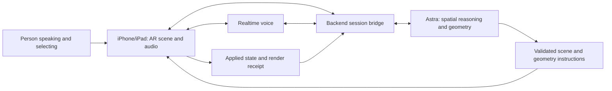

# Astra AR — framework research

2026-09-08. Initial research background. Core contracts, the native app, RealityKit adapter, unified Realtime conversation path, and session service now exist. Live Astra-to-Swift runs and signed iPad camera deployment have passed; acceptance of the updated composer, automatic hand mode, and combined physical interaction remains pending. The current design is [architecture.md](architecture.md); the chronological Arav/Astra collaboration log is [APPROACH.md](APPROACH.md). Where this research discusses alternatives, the architecture document records the current choice.

The subsequent deeper design specifies [model authoring and the asset pipeline](docs/asset-pipeline.md), [data formats and transport](docs/data-formats.md), and [persistence](docs/storage.md). The implemented authoring path uses one structured `propose_scene` call. Future code authoring can target the same normalized contract; progressive generation remains planned.

Subsequent user direction expands the native app to [iPhone and iPad](docs/devices.md) and makes [screen-aligned pointing](docs/gestures.md) required for demo acceptance. The primary demo target is iPad Air M4 on iPadOS 26.5; iPhone 15 Pro is the second test device.

## Recommendation

Use **Swift + SwiftUI + ARKit + RealityKit** in one universal iPhone/iPad app, a thin **TypeScript/Node backend**, **GPT-6 Astra through Responses** for spatial reasoning and geometry generation, and one **Realtime conversation for typed text and voice**. Start with one bounded complete model proposal and the continuous voice-to-generation loop using schematic geometry. Compare authored deconstruction and live creation within that loop. Keep Quest outside the first device acceptance test.

The first user is exploring hardware architecture. The important experiment is whether a spoken request can produce a useful, editable spatial explanation fast enough to sustain conversation. Building the whole framework before measuring that would postpone the main uncertainty.

The user explicitly places initial visual fidelity below on-demand usefulness: do not turn the first milestone into CAD reproduction or an asset-polishing exercise. A new airflow visualization or rearranged fan assembly in response to speech is a valid first result.

## Two paths, one scene

| Path | What exists before the request | What Astra does live | What the result establishes |
| --- | --- | --- | --- |
| Authored assembly | Separate meshes, component hierarchy, rest poses, metadata | Chooses parts, arrangement, reveal order, annotations, and explanation | Model-directed deconstruction and conversation |
| Generated interior | Rack or chassis exterior, available dimensions/references | Creates new component geometry, semantic hierarchy, layout, and explanation | Live generation quality, latency, and editability |
| Entire generated assembly — follow-on | Generic geometry builders and optional references | Describes the whole small assembly from the request | Whether generation can extend beyond an authored starting shell |

“Pre-rendered” needs care: a picture or fused exterior mesh is not a decomposable assembly. CAD also needs conversion to renderable parts while preserving hierarchy. Authored components may themselves be schematic. Generated hidden interiors are illustrative reconstructions unless a specific reference substantiates them.

## Native rendering and portability

RealityKit constructs the current six-shape scene vocabulary from the normalized JSON recipe. Use ARKit raycasting to place the rack on a real surface and collision hit testing for picking virtual components. Store rest transforms so repeated explode/restore operations do not accumulate drift. Approved bundled USDZ hierarchy import now shares the scene with generated recipes through immutable asset/part references. Text labels, arbitrary model-supplied mesh import, bounded array expansion in the provider path, and source-code execution remain unimplemented. [MeshResource](https://developer.apple.com/documentation/realitykit/meshresource), [RealityKit hit testing](https://developer.apple.com/documentation/realitykit/arview/hittest(_:query:mask:)).

Keep these outside renderer-specific classes:

- Stable semantic node IDs, parents, roles, bounds, metadata, and relationships.
- Versioned scene operations and generated geometry descriptions.
- Metres, a documented axis/handedness convention, local transforms, and explicit pivots.
- Geometry provenance and optional source references.
- Original asset sources with reproducible USDZ/GLB exports; basic materials with renderer-specific mapping.

Use a JSON sidecar for semantics. Blender exports custom properties, but importer behavior must be checked; names alone are not a dependable unique ID. [Blender USD](https://docs.blender.org/manual/en/latest/files/import_export/usd.html), [glTF specification](https://registry.khronos.org/glTF/specs/2.0/glTF-2.0.html).

Unity AR Foundation is a credible alternative and has providers for iOS and Quest, with unequal platform features. With no existing Unity preference, native Swift is the recommendation for the universal iPhone/iPad app. A later Unity/OpenXR Quest client can reuse the backend, scene protocol, and asset semantics; the RealityKit renderer itself will be rewritten. [Unity AR Foundation](https://docs.unity3d.com/Packages/com.unity.xr.arfoundation@6.4/manual/index.html).

Ordinary iPhone WebXR is not the main path: a WebKit maintainer confirmed its absence on iOS in March 2026. Quick Look also does not provide our proposed continuously controlled in-app scene. [WebKit issue](https://bugs.webkit.org/show_bug.cgi?id=309550), [model-viewer AR modes](https://modelviewer.dev/docs/index.html#entrydocs-augmentedreality-attributes-arModes).

## Live geometry experiment

Start with **Astra-generated geometry descriptions → validated native mesh builders → RealityKit entities**. The proposed vocabulary begins with generic boxes, cylinders, arrows, lines/tubes, text, transforms, materials, repeated elements, and a bounded custom-mesh route; consider extrusion only where a useful visual needs it. Astra chooses the actual parts, parameters, arrangement, and hierarchy at runtime. Avoid a canned `make_demo_rack()` generator masquerading as live creation.

This is procedural 3D generation: the model emits geometry instructions as text, and application code constructs the meshes. It does not require a native mesh-output modality or runtime compilation of generated Swift. Keep raw vertex dumps as a comparison, not the default: repeated fins, fans, and slots can be described compactly with parameters instead of thousands of output coordinates.

RealityKit's [`MeshDescriptor`](https://developer.apple.com/documentation/RealityKit/MeshDescriptor) supplies custom geometry. Apple's [`LowLevelMesh`](https://developer.apple.com/documentation/RealityKit/LowLevelMesh) supports frequent CPU/GPU mesh updates, but recommends the simpler descriptor approach when sufficient. Adding components progressively does not by itself require a low-level dynamic-mesh engine.

Install complete, independently valid components as they arrive. Give each component a stable ID immediately so “make that narrower” can revise it. Maintain geometry, materials, semantic metadata, and source classification together through replacement and undo. A slower server-side Blender/code-to-USDZ route is a fidelity experiment if the native vocabulary cannot express a useful component; it should earn its additional export/import latency through measurement.

Prototype the comparison on a single server chassis first. Use the same requested components and camera framing across routes. Repeat several requests; report sample count and median/range rather than an unsupported latency percentile.

| Measurement | What to record |
| --- | --- |
| Usefulness | Does the generated visual answer the current request, and can the person steer it naturally in the next utterance? |
| First useful result | End of spoken request to the first meaningful visible change; also separate transcript, model, mesh build, transfer, and installation times |
| Complete assembly | Time until all requested parts are visible and selectable |
| Quality | Recognizable parts, plausible proportions, reference agreement where applicable, unwanted intersections, and readable exploded layout |
| Editability | Can a new follow-up change one generated part without regenerating or corrupting the rest? |
| Interruption | Can a correction stop obsolete geometry from appearing and preserve accepted work? |
| Device behavior | Frame time, memory, tracking stability, and rendering during audio/model activity |
| Model contribution | Actual model ID, response/tool IDs, output usage, generated recipes/artifacts, and execution receipts |

Choose latency and visual targets after the first samples; no subsecond generation claim is established by this research.

## Astra and voice ownership

The [Astra model page](https://developers.openai.com/api/docs/models/gpt-6-astra) lists text/image input, text output, streaming, function calling, and structured output, but no audio support. Use `gpt-6-astra` through Responses for tools. Doppler-backed model access, actual generated scene acceptance in Swift, and native simulator/device builds are verified; see [the run evidence](evidence/README.md).

The device owns actual scene state. Astra receives current node IDs, selection, geometry bounds, state revision, and references. An optional visual input must include the rendered virtual content: a composited AR snapshot, not just the raw camera image. Send frames when useful for a request or validation, not continuously by default.

Use a minimal scene contract: inspect current state; apply a bounded batch of create/replace/remove/transform/highlight/annotation operations; cancel a generation; undo a transaction. Slow mesh jobs can be asynchronous. Serialize commits, reject stale revisions, validate IDs/indices/finite dimensions/budgets, and preserve the last valid scene after rejection. Distinguish job acceptance, installed geometry, and animation completion in tool results.

Realtime handles audio transport and conversational delivery. Spatial changes and substantive generated content should be delegated to Astra. Acknowledging a request is fine while geometry builds; an explanation must not claim a part has appeared before the device confirms it. A tap provides the part ID for “this.” Ask for clarification when selection and context do not resolve the reference.

Use [`gpt-realtime-2.1`](https://developers.openai.com/api/docs/models/gpt-realtime-2.1) over the implemented native Swift WebSocket and `AVAudioEngine` path. WebRTC and a backend sideband remain unchosen alternatives, not the current transport. [Conversation interruption](https://developers.openai.com/api/docs/guides/realtime-conversations#interruption-and-truncation).

For WebSocket audio, stop actual playback on interruption and truncate conversation audio to what was played. Speech cancellation and geometry-job cancellation are separate operations. New voice corrections must reach an active Astra request instead of waiting for an old bridge call to complete. [Conversation interruption](https://developers.openai.com/api/docs/guides/realtime-conversations#interruption-and-truncation). A chained speech-to-text → Astra → text-to-speech loop is an available fallback, but does not establish the desired fluid speech-to-speech experience. [Voice architectures](https://developers.openai.com/api/docs/guides/voice-agents).

## Astra-specific capability demonstrations

1. **Direct structured proposal:** the service makes one fresh HTTP Responses request using `propose_scene`; its complete JSON result is normalized and sent to Swift. PTC, async tools, and Responses steering are future experiments, not current capabilities.
2. **Visual correction — optional after the core loop:** provide a rendered snapshot plus scene IDs, ask Astra to identify a layout problem, and apply its corrective patch. Geometry checks remain necessary; model self-review alone is not acceptance evidence.

Keep the first proposal bounded and complete. Start with low reasoning for routine commands and compare more reasoning for difficult generation. The model's documentation establishes supported features, not acceptable latency or geometry quality for our use case. [Model guidance](https://developers.openai.com/api/docs/guides/latest-model).

## Demo and verification

A promising sequence: place rack → ask “show how air moves through this” → create a useful airflow schematic → interrupt with “separate the fans so I can see them” → generate/rearrange those parts → ask a new follow-up while the explanation continues. Include authored deconstruction or generated internals when useful; choose the exact one-minute cut from measured behavior. Preserve real timing; do not present sped-up generation as live latency.

Let an unfamiliar request choose the target, subset, shape, or operation order. Verify: no canned question-to-animation map; generated artifacts were produced during the request; selected IDs match visible targets; stale jobs cannot add parts; undo restores the previous assembly; narration matches receipts. Show a walk around the anchored model so the spatial benefit is visible.

Keep one useful failure/diagnosis/fix in the development record. A clean second assembly or new generated component using the same protocol is stronger evidence of a framework than adding a large tool catalog.

## What remains unverified

- Physical pointing accuracy, microphone/playback quality, interruption behavior, and the complete spoken loop. The signed app and rear-camera deployment exist on the verified iPad Air 13-inch (M4), iPadOS 26.5; acceptance of the updated composer and automatic hand path remains pending. The iPhone 15 Pro on iOS 26.6.1 has launched the universal build, but its full physical interaction trial remains pending.
- Full native service round trips and latency on venue networking. Separate live headless generation/explanation runs took approximately 10–24 seconds; these are not device display latency measurements.
- Imported CAD/USDZ hierarchy, redistribution rights, and hardware reference accuracy. The bundled starting rack is an original authored schematic JSON assembly.
- Generalization beyond the first generated fan/rack examples, conversational generation time, sustained device performance, and Quest execution.

Possible references, not accepted dependencies: [Dell R760 interior documentation](https://www.dell.com/support/manuals/en-us/poweredge-r760/per760_ism_pub/inside-the-system?guid=guid-043d9f52-a16e-4494-a65a-128c47fd4ea4&lang=en-us) for a particular server layout; [Poly Pizza rack](https://poly.pizza/m/6ijQclm8jxw) as a potential exterior (agent found an attribution license; hierarchy and interior detail still need inspection). Authoring a small reference assembly may be faster than repairing an unsuitable model.
