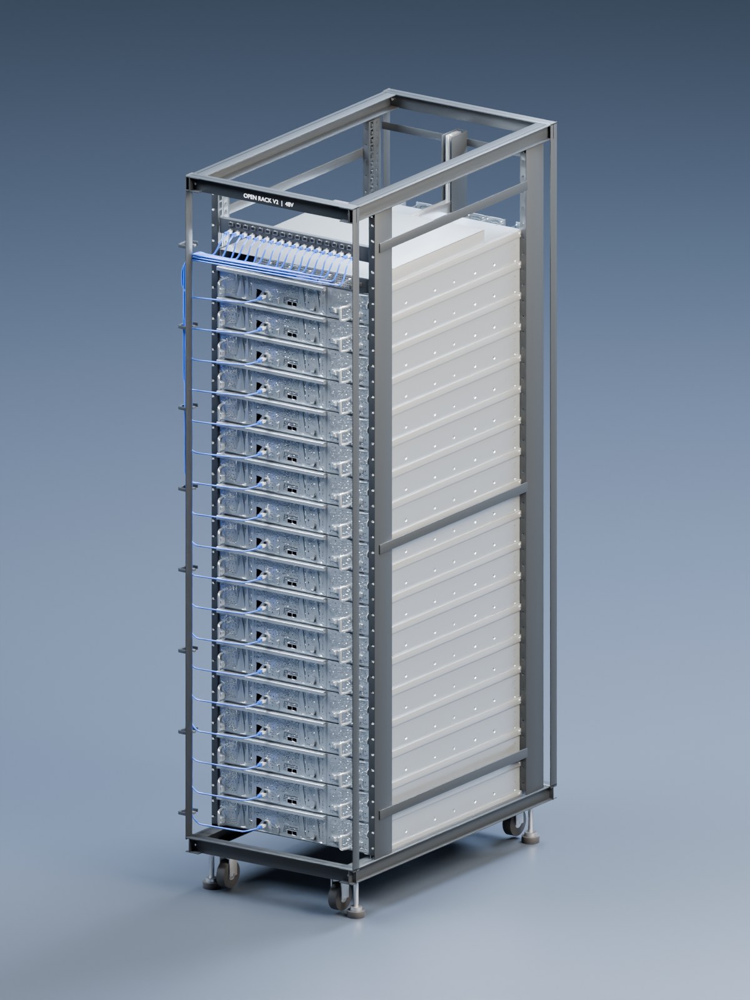

# Rack Lab · saved hardware, loaded on demand

One vertical Open Rack V2 stack with 18 closed Barreleye G2 server exteriors. Detailed mechanical parts, motherboard components, memory and an explanatory POWER9 study are pregenerated in a separate library. Selecting or asking about equipment loads the requested collection; repeat requests reuse it.



## Start

From the repository root, fetch the binary assets and check the package:

```sh
git lfs install
git lfs pull
python3 datacenter-rack/scripts/check_package.py
```

Launch Blender with the question controls:

```sh
export BLENDER_BIN='/path/to/Blender'
python3 datacenter-rack/scripts/launch_rack.py
```

On macOS, `scripts/Open Rack Lab.command` runs the same launcher. Blender 5.3.0 Alpha was used and tested; other Blender versions are unverified. The launcher also detects `/Applications/Blender.app/Contents/MacOS/Blender`.

## Use

- **Agents:** [exact usage and integration contract](docs/AGENT_USAGE.md).
- **People:** select a server, press **N → Rack Lab**, and use **Load Inside**, **Motherboard**, **Memory**, or **Processor Study**. The question field accepts examples such as “Show the CPU in server 3” and “What does U14 do?”. See [inspection controls](docs/LAZY_INSPECTION.md).
- **Application integration:** [question context](docs/QUESTION_CONTEXT.md), [asset architecture](docs/LAZY_ASSET_ARCHITECTURE.md), and `models/lazy/manifest.json`.
- **Rebuild:** [source pipeline and dependencies](docs/REPRODUCING.md).
- **Evidence:** [verification and measured limits](docs/VERIFICATION.md), [hackathon process](docs/HACKATHON_PROCESS.md), [journal](docs/PROCESS_JOURNAL.md), and `logs/`.

## Delivered files

| File | Purpose |
|---|---|
| `models/lazy/rack-exterior.blend` | Default scene: one rack, 80 objects, 21 meshes, no detail loaded |
| `models/lazy/parts-library.blend` | Full pregenerated detail library: four independently loadable collections |
| `models/lazy/exterior-library.blend` | Closed-server exterior reusable independently |
| `models/lazy/manifest.json` | Asset IDs, collection names, placements, units and loading rules |
| `models/lazy/part-knowledge.json` | Detailed part metadata without loading Blender geometry |
| `source/component-library.json` | Source-backed component identities, functions and limitations |
| `models/datacenter-rack-v002.blend` | Full editable authoring master with rack, server, board and processor scenes |
| `models/lazy/rack-exterior.glb` / `.usdz` | Exterior interchange exports; retain the Blender library for detailed inspection |

The motherboard represents 6,663 populated source reference designators, combining 6,596 fabrication-derived objects with 67 matching CAD components. Source CAD, authored reconstruction, memory class analogues and explanatory processor internals retain separate evidence labels. This is a visual learning asset; device performance, robot physics and electrical interoperability are unvalidated. All four detail collections are supplied as Blender assets; GLB/USDZ exports currently cover the exterior only.

See [source notices](licenses/README.md) before redistributing derivatives. Manufacturer research PDFs, caches, credentials and unrelated local captures are excluded. Published logs describe observable actions, including failures and retrospective entries; they do not claim an uninterrupted screen recording or expose private reasoning.
