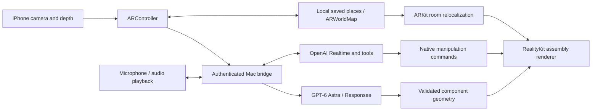

# Architecture walkthrough

## Follow one reconstruction

1. `ARController.reconstruct` checks camera tracking and resolves the selected surface point. It freezes the AR camera, viewport conversion, world point and depth snapshot alongside the JPEG. A moved camera later must not change where the original capture belonged.
2. `BridgeClient` sends that JPEG and target metadata to the Mac. `server.mjs` calls Responses with the strict schema in `schema.mjs`, streams progress and validates the final payload.
3. `Assembly.validated` checks again on the device. `ARController.install` estimates a surface basis and scale from depth and image bounds.
4. `AssemblyRenderer.install` creates component groups, collision geometry, material styles and a world anchor. The root's world transform becomes the immutable home pose for this assembly.
5. Explode changes each component group's local translation. Pull out and movement change the root. Return restores home. These are separate transforms so taking a model apart does not move its source anchor.

## Follow one save and return

`RoomStore` stores one JSON envelope per place, with map bytes and object records. Each write is atomic. `ARController` saves only when mapping quality is sufficient, and rejects callbacks from obsolete sessions.

A loaded map is a candidate, not proof that the user is in that room. `nextPlace` starts ARKit with `initialWorldMap`; `restorePlace` is gated on the relocalizing-to-normal transition. Only then are saved assemblies instantiated. This prevents blindly displaying old coordinates in a fresh unrelated tracking frame.

Saved `home` and `pose` matrices are both needed. A pulled-out model should reopen at its current location while **Return** still knows its original source position. Component offsets and display flags are persisted separately.

## File map

| File | Responsibility |
|---|---|
| `spatial-assembly/ios/SpatialAssembly/ARController.swift` | Camera capture, placement, selected model, room lifecycle and voice commands |
| `spatial-assembly/ios/SpatialAssembly/DepthSnapshot.swift` | Frozen depth, pixel-to-world projection and estimated surface normal |
| `spatial-assembly/ios/SpatialAssembly/Assembly.swift` | Codable geometry contract and native bounds validation |
| `spatial-assembly/ios/SpatialAssembly/AssemblyRenderer.swift` | RealityKit primitives, parts, home/current transforms and gestures |
| `spatial-assembly/ios/SpatialAssembly/RoomStore.swift` | Atomic place persistence and map decoding |
| `spatial-assembly/ios/SpatialAssembly/BridgeClient.swift` | Authenticated phone WebSocket lifecycle |
| `spatial-assembly/ios/SpatialAssembly/RealtimeAudio.swift` | Native microphone capture, PCM conversion and audio playback |
| `spatial-assembly/ios/SpatialAssembly/SpatialAssemblyApp.swift` | Native controls, parts list, connection settings and saved places |
| `spatial-assembly/server/server.mjs` | OpenAI coordination, streaming generation and Realtime tool results |
| `spatial-assembly/server/schema.mjs` | Allowed geometry/actions and reconstruction instructions |
| `spatial-assembly/configure.py` | Generates local pairing configuration without an OpenAI key |

## Boundaries

GPT describes approximate geometry; it does not run the tracking loop. ARKit tracks room coordinates; it does not infer component identity. Depth is measured, but fitting generated geometry to it remains approximate. Internals labeled inferred are not discoveries about the real object. Local persistence works without regeneration, while new generation and voice require the running bridge and network.

## Shared reference-aware bridge and Quest client

`spatial-assembly/server/bridge.mjs` owns authenticated sessions, injected API access for tests, voice tools and generation lifecycle. `research.mjs` handles visible identity and required web search, source URL grounding and exact/similar evidence labels. `schema.mjs` bounds geometry, including small custom meshes. A per-session in-memory cache holds up to twelve source images for refinement; images are not part of saved-room geometry. After reconnect, refining a restored object requires a fresh capture toward its source location. Revisions retain object identity/poses rather than replacing the place. `scene.update` restores voice context without a new generation.

The Quest client uses Unity/OpenXR with Meta camera, depth and spatial-anchor APIs. `QuestAssemblyController` freezes image-associated projection and source-plane context; `AssemblyModel` builds selectable component geometry; `SavedAssemblies` persists local anchor IDs and geometry/state; `BridgeConnection` and `RealtimeAudio` carry authenticated messages and opt-in audio. These are separate platform renderers sharing an assembly contract, not cross-device shared anchors. Source URLs/explanations persist inside saved assemblies.
