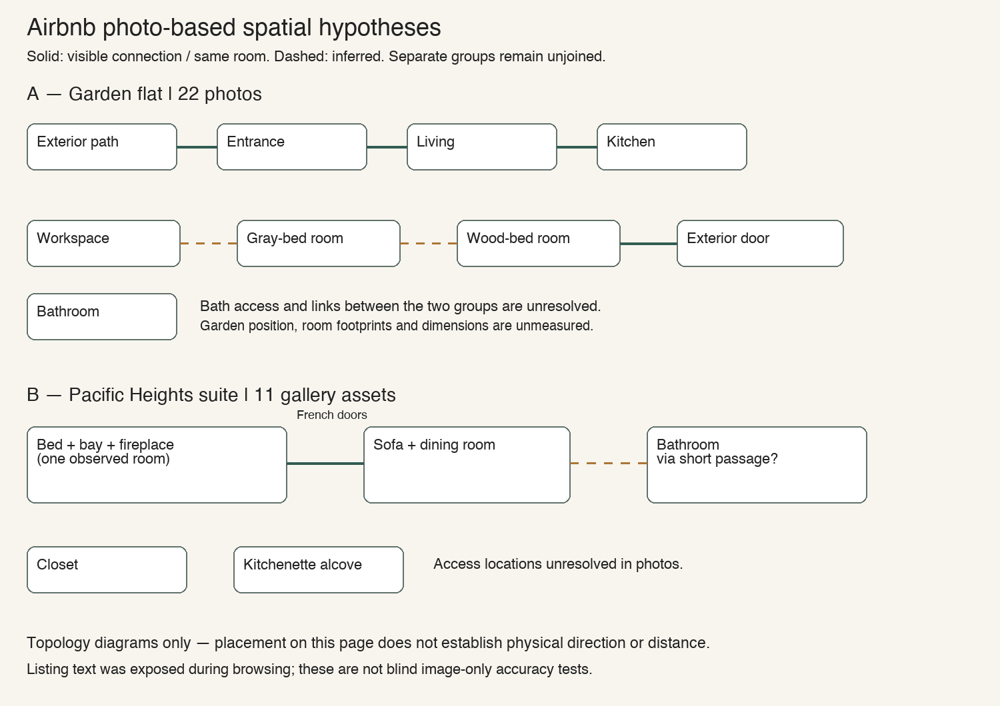

# Photo-led comparison and video tour-data preparation

September 8, 2026. Follow-up to the [video experiment](VIDEO_FLOOR_PLAN_EXPERIMENT.md). The user's videos remain the primary evidence; public photos are an additional comparison. The [Astra operational log](ASTRA_PROCESS_LOG.md) records tools, browser actions, sampling, failures, corrections and limits.

## Two Airbnb gallery experiments

Browsed [the garden flat](https://www.airbnb.com/rooms/1586369805694396546) and [the Pacific Heights suite](https://www.airbnb.com/rooms/18981477), opened each complete photo gallery, scrolled through screenshots and exported loaded photo assets for closer inspection. All 22 first-listing photos and 11 second-listing assets were viewed in indexed sheets. Four first-listing high-resolution exports failed, then their observed 720-pixel variants succeeded. Three first-listing and one second-listing images were reopened individually.

The garden flat supports exterior entrance → living → kitchen by matched vase, bench, artwork, furniture and co-visible openings. Bedroom/workspace relationships remain partly inferred; bathroom access and the global join between photo groups remain unresolved. The suite shows bed, bay seat and fireplace in one room, connected through French doors to a sofa/dining room. A bathroom connection is supported by matching visible steps through a passage; closet/kitchenette access is unresolved in photos. Asset counts include detail shots, neighborhood imagery or informational graphics, not only independent room views.

**Limitation:** listing text, room counts and gallery labels were exposed during browser navigation; the second DOM snapshot included descriptive prose. These are photo-led hypotheses with cited visual anchors, not blind image-only tests. No external floor plan was used. No ground-truth accuracy percentage or complete building outline is claimed. Public listing photos are not republished in the repository.

## Guided-tour data for both supplied videos

Created a local JSON and readable table with **nine proposed home points and one candidate hall pan station**, tied to **40 references to actually viewed frames**. Fields include source hashes, PTS/time base, exact timestamps, observed wall anchors, missing views, proposed route edges, uncertain edges, recapture instructions and constraints for possible later generation. Dining entry and reverse revisit are recorded as separate time intervals.

These are editorial tour points on an observed route, not recovered camera positions. Pose, metric location, yaw/pitch and coverage percentage remain null; all points have `panorama_ready: false`. Moving between video frames changes the camera center, so opposite views are not automatically stitchable. The bedroom and utility glimpse need further capture. Hall pans support four wall identities but do not prove full spherical coverage.

Read the local video-to-walkthrough planning references and ran the environment doctor (FFmpeg/FFprobe/Node available; COLMAP/Nerfstudio absent). **No panorama, mesh, splat, depth map, synthesized room view or 3D reconstruction was generated.** The user's request was data preparation only. Existing frames were copied; only 2D evidence diagrams were drawn.

## Validation and unresolved work

Validated reference IDs, viewed flags, exact source PTS/times, local frame files, route IDs and document links; inspected diagrams. No iPhone runtime code changed. The user's human check of the video-based layout is still pending, especially the candidate second study access, doorway offset and laundry enclosure. New footage or ground truth is needed to turn hypotheses into a complete measured layout.

[Complete spatial-analysis artifacts, panorama inventory and evidence](spatial-analysis/README.md).
