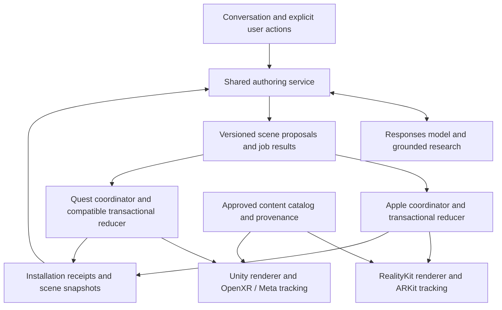

# Quest implementation and integration handoff

This is the architecture handoff for integrating the Akeil Quest work into Arav's organized product codebase. It describes the implementation being handed over, the compatibility gaps, and a proposed migration sequence. It does not implement the integration.

## Start here

Use **Arav as the product repository structure**, keep its shared scene contract and accepted-state architecture, and bring the Quest implementation across as a Unity/OpenXR client. Port the useful backend capabilities into the shared service. Preserve authored rack assets and component identities as content, with platform-specific resource compilation and loading.

Read sections 1–3 before changing code. Read sections 4–8 when implementing the Unity adapter or backend compatibility. Section 9 covers the rack asset work. Section 10 is the implementation sequence; section 11 defines evidence needed before calling the integration complete.

### Source pins and delivery status

| Source | Reviewed revision | Purpose |
| --- | --- | --- |
| Akeil branch | `5cf784840d8c9ce22dcbbe71f52b585d12ab2282` | Source snapshot before this documentation change |
| Quest recursive-detail implementation | `06144bc` | Latest Quest/backend feature revision within that snapshot |
| Arav branch | `ef10dcbd5160b05205d61f5080a31ef117cfa900` | Product structure, shared contract, imported rack and lazy details |
| Arav delivery-time update | `8d93cb31aa756f7ab4643dd5c2f85a0e70682432` | Subsequent illustration integration; delta inspected before publishing this handoff |

Repository: [abharw/astra2026](https://github.com/abharw/astra2026). At these pins the branches have **no common merge base**. Perform a deliberate file/module port into Arav; a whole-tree merge would combine unrelated histories and competing application structures.

The recursive-detail APK was built and subsequently installed at the wearer's request; its bridge was also restarted on that source. The earlier “staged only” journal and Quest README text describe the preceding delivery checkpoint. The newer concurrency, walkthrough and recursive-detail behavior has source/build evidence, **not completed wearer acceptance**. See [the historical test record](QUEST_LIVE_TESTING.md) for earlier physical observations. This handoff includes no new builds, installations, backend changes or remote headset tests. The wearer has reserved runtime testing for themselves; preserve that boundary unless they explicitly change it.

The Arav descriptions below are source findings at its pin, not a claim that its current branch or device has been tested in this handoff. Refresh both branch tips before integration and account for subsequent changes.

At delivery, Arav advanced to `8d93cb3`, adding negotiated `illustration.v1` jobs, authenticated checksummed image artifacts and an Apple image panel. Preserve those additions during the port. They are a separate image-generation lifecycle, not support for concurrent geometry scopes or a Quest image renderer. The delta also gates new authoring on a synchronized accepted-scene snapshot after receipts; retain that gate. See [its integration status](https://github.com/abharw/astra2026/blob/8d93cb31aa756f7ab4643dd5c2f85a0e70682432/docs/images-2.5-integration-status.md) for that branch's recorded evidence and limits; those results were not rerun here.

## 1. Target ownership

The shared boundary is the **data contract and its semantics**. Arav's Foundation-only `SpatialCore` is a useful reference reducer, but its Swift implementation is not an Android Unity library. Implement a C# consumer with identical decoding, validation, hashing, transaction and receipt behavior. Share contract fixtures across languages. `SpatialApple` remains an Apple adapter; copying its RealityKit or ARKit code cannot produce a Quest renderer.

Suggested homes in Arav's existing structure, all proposed:

| Home | Responsibility |
| --- | --- |
| `framework/contract/` | Versioned wire schema, canonical hash rules, capabilities and conformance fixtures |
| `quest/` | Unity project, C# scene consumer, rendering/input/audio/anchor adapters and Android build setup |
| `backend/src/` | Authoring, research, bounded job scheduling, detail planning, receipt-gated results and scene context |
| `assets/imported-rack/` | Source-derived assets, stable component mappings, approved detail templates and licenses |
| `tools/` | Offline asset conversion and conformance/build tooling |
| `app/` and `framework/Sources/SpatialApple/` | Existing Apple product and platform implementation |

The accepted scene on each device is authoritative. GPU entities derive from it. The backend's acknowledged mirror is context for reasoning, not evidence of rendering or physical alignment. The model never enters the tracking/render frame loop. Platform anchors remain local; neither branch implements a common cross-device physical coordinate system.

## 2. Code to bring over

Paths in this table are relative to the Akeil root. The links resolve on this branch.

| Source | Responsibility and useful entry points |
| --- | --- |
| [QuestAssemblyController.cs](../quest/Assets/SpatialAssembly/Runtime/QuestAssemblyController.cs) | Composition, controller/hand actions, explicit selection, frozen `Snapshot`, `Capture`, `OnMessage`, `Place`, `ReplaceObject`, `Command`, job/selection epochs |
| [AssemblyModel.cs](../quest/Assets/SpatialAssembly/Runtime/AssemblyModel.cs) | `AssemblyData`, `PartData`, primitive validation, `Geometry`, `AssemblyVisual`, selectable `PartHandle`, home/current poses, descendant inspection transforms |
| [SavedAssemblies.cs](../quest/Assets/SpatialAssembly/Runtime/SavedAssemblies.cs) | Meta spatial-anchor save/localize/bind, atomic local JSON records, autosave, delete race protection |
| [BridgeConnection.cs](../quest/Assets/SpatialAssembly/Runtime/BridgeConnection.cs) | Authenticated WSS, receive queue dispatched on Unity update, serialized sends, reconnect/backoff, optional foreground gating |
| [RealtimeAudio.cs](../quest/Assets/SpatialAssembly/Runtime/RealtimeAudio.cs) | Microphone permission, PCM conversion, playback queue, response completion markers, interruption and pause |
| [QuestTestControl.cs](../quest/Assets/SpatialAssembly/Runtime/QuestTestControl.cs) | Optional app-level test interface; separate from normal voice and control; currently off by default |
| [BuildQuest.cs](../quest/Assets/SpatialAssembly/Editor/BuildQuest.cs) | Unity scene creation, Android/XR configuration and APK build |
| [bridge.mjs](../spatial-assembly/server/bridge.mjs) | Authenticated session, Realtime tools, research/reconstruction lifecycle, four jobs, cancellation, commands, audio-paced tour |
| [schema.mjs](../spatial-assembly/server/schema.mjs) | Provider schema, generated geometry limits, evidence instructions, actions and validation |
| [detail.mjs](../spatial-assembly/server/detail.mjs) | `componentIds`, `detailConflict`, subtree comparison and `mergeDetail` |
| [research.mjs](../spatial-assembly/server/research.mjs) | Image-based identity research, actual source URLs and exact/similar evidence normalization |
| [server.mjs](../spatial-assembly/server/server.mjs) | API adapter and server entry point |
| [configure.py](../spatial-assembly/configure.py) | Private client/bridge pairing configuration |

Port the Unity project configuration, packages and required resources with the source. The known build uses Unity `6000.3.23f1`, Meta MRUK/Core `85.0.0`, OpenXR `1.15.1` and Newtonsoft `3.2.1`; consult [Quest setup](../quest/README.md) and its actual manifests before changing versions. Keep private connection configuration out of Git.

The existing Akeil iPhone renderer is a separate implementation under `spatial-assembly/ios/`. Arav already has a more organized Apple application. Use the Akeil phone code as a behavior reference where needed, rather than introducing a second Apple app as the final product.

## 3. Behavior that must survive

| Capability | Current meaning |
| --- | --- |
| Explicit intent | Right trigger selects a physical referent or generated component. A physical selection needs thumbstick confirmation or explicit voice reconstruction intent before generation. Selection alone starts no scan. |
| Multiple objects | Existing models remain present while another reconstructs. Finishing a job does not take selection from newer wearer input or replace the held object. |
| Concurrent work | Up to four independent reconstruction/refinement jobs; disjoint component subtrees may deepen concurrently. |
| Stop | Y while busy or the voice cancellation tool clears pending reconstruction work; epoch fencing discards delayed work. |
| Manipulation | Grip/pinch, bring-to-me, movement, rotation, scale, explode/assemble, part focus, housing reveal/close and Return. |
| Return | Restore the complete object's original anchor-relative position, rotation and scale, reset component inspection transforms and close housing. |
| Teaching | Explain actual selected parts with source/evidence context; guided tours wait for device command acknowledgment and local playback completion. |
| More detail | Deepen an existing part, including an already generated subcomponent, while preserving unrelated assembly data. |
| Persistence | Restore saved geometry locally after anchor localization; new cloud generation is not required to reopen it. |
| Failure handling | Camera/depth/network/anchor failures remain visible. Reconnect retains placed objects. A rejected detail patch retains prior geometry. |
| Provenance | Visible, exact-model documented and inferred/similar-model information remain distinct. |

For exact controller mappings use [Quest controls](../quest/README.md). The guide is instruction-only, with hide/show and smooth following. Retain explicit delete, restore retry and optional voice controls. Physical comfort and latest interaction acceptance remain wearer checks.

## 4. Current capture-to-world pipeline

1. **Resolve a target locally.** A right-controller ray intersects environment depth; hand/controller input locks the physical point and normal. Generated geometry uses local collision/part handles for selection. These are distinct referents.
2. **Freeze the measurement.** `Capture` uses the passthrough camera's associated pose and projection, projects the target into that image, and retains camera pose, target, normal and four calibrated local corner rays in a per-job `Snapshot`. The normalized wire target uses top-left image origin: `[viewport.x, 1 - viewport.y]`.
3. **Send a bounded request.** The image is a JPEG data URL plus request/object IDs, epoch, mode, optional part ID, hint, image target and camera distance. World projection data stays in the local snapshot. The backend does not author the headset's world anchor.
4. **Research and generate.** The bridge researches the visible identity and technical references, calls Responses with a strict assembly schema, validates the result and normalizes evidence/source references. Search failure is reported and can fall back to image-only generation with explicit gaps.
5. **Fit the new result locally.** `Place` projects the generated image bounds through the frozen rays onto the captured surface plane. It estimates scale from horizontal/vertical extent, derives orientation from the surface normal and creates a Meta spatial anchor with a child `AssemblyVisual`.
6. **Install or refine.** A new object uses its own snapshot. Refinement replaces the geometry under the existing anchor while preserving object ID, home/current transforms, display flags and live inspection state through `CopyInspectionFrom`.

This is single-view, source-assisted approximation. Depth supports surface placement, not full object scanning. The current fit clamps the scale and ray distance and can fail on unreliable projections. The physical anchor is stationary: moving the real object does not make its generated counterpart track that object.

`inspect_view` obtains a fresh raw passthrough camera sample. That image does not include Unity geometry or the instruction panel. Voice needs scene context to describe virtual objects; absence from the camera sample is not evidence of absence from the app. Continuous video perception is not implemented.

### Coordinates and geometry: conversion is required

| Concern | Akeil generated assembly | Arav scene contract |
| --- | --- | --- |
| Units | Longest object dimension normalized to 1; `sizeMeters` supplies estimated proportions/size; actual root fit is local | Metres; authored rack root scale 1 preserves 2.21 m height |
| Part coordinates | Primitive positions are relative to the whole assembly, even inside a refined component | Node transforms are relative to their parent |
| Orientation | Generation prompt: +Y up, +X right in front view, +Z toward front viewer; runtime Unity basis | Right-handed model space, +Y up, +Z forward |
| Rotation | Euler XYZ degrees; renderer composes Z × Y × X | Unit quaternion `[x,y,z,w]` with strict validation |
| Geometry | Box, sphere, cylinder, cone, torus and small indexed mesh | Box, sphere, cylinder, cone, tube, arrow and approved imported assets |
| Materials | Primitive RGB with a solid/hologram display mode | Shared materials plus imported native PBR resources |

Choose and document one basis conversion at the Unity contract boundary. Apply it consistently to position, quaternion, vertices, normals, winding, bounds and input rays; translating only positions is insufficient. Preserve local metre transforms for imported content. Convert normalized generated geometry using its installed root transform, rather than multiplying `sizeMeters` into a root that has already been fitted. Use an asymmetric orientation fixture and parent/child round trips to expose double rotations, mirrors and double scaling.

The Akeil part hierarchy is semantic: `AssemblyVisual.Build` creates sibling part groups under the root, then explicitly propagates transforms to descendants. Arav has actual parented scene nodes. A direct conversion of `parentPartId` plus existing assembly-relative coordinates would apply ancestor transforms twice. Derive parent-local transforms when creating the true hierarchy.

### Existing data shape and bounds

`AssemblyData` contains `name`, `description`, `confidence`, image `bounds`, `sizeMeters`, `parts`, and bridge-added `research`, `captureId`, `revision`. A part contains identity, description/function/uncertainty, evidence, source IDs, internal/housing flags, explode vector and primitive list. Detail merge adds `parentPartId` and `detailLevel`.

The provider's strict schema returns at most 24 parts, each with at most 16 primitives. The accepted composite validators permit at most 96 parts and 1,024 primitives. Custom meshes permit 3–256 vertices in primitive-local `[-0.5, 0.5]` and at most 1,536 indices, in triangles. The backend additionally rejects degenerate triangles. Dimensions must be finite, positive and at most 20 m per axis; normalized primitive positions/sizes and other vectors have separate bounds in `schema.mjs`.

These are model-output safeguards, not a performance budget for imported rack CAD. Keep imported content on a distinct approved-resource path. The prompt's suggested primitive counts are softer than the validators; use the validators as the enforceable limits.

## 5. Legacy bridge and lifecycle

The current Akeil bridge advertises **protocol 2**; Arav's service/scene contract advertises **version 1**. These numbers belong to different protocols and do not indicate interoperability.

The legacy service exposes unauthenticated `/health`, authenticated `/status` and authenticated WSS `/session`. Normal client authentication is a scoped bearer token. The server defaults to loopback port 8796; deployments can override it. Client configuration uses an HTTPS/WSS tunnel. The OpenAI key remains on the bridge. A privately paired APK contains its bridge credential and should not be committed or distributed as a public artifact.

### Relevant legacy messages

This is an integration map, not a replacement schema; read the handlers before changing envelopes.

| Direction | Message | Fields/meaning |
| --- | --- | --- |
| Client → bridge | `reconstruct` | `request_id`, `epoch`, `object_id`, `mode`, `part_id`, `hint`, `target`, `distance`, `image` |
| Client → bridge | `rebuild` | Existing `object_id`, `request_id`, epoch and correction; use cached capture or request a fresh one |
| Bridge → client | `capture.request`, `rebuild.request` | `request_id`, epoch, hint; rebuild also binds object and `detail_part` |
| Client → bridge | `capture.error` | Matching request ID and truthful camera failure |
| Bridge → client | `reconstruction.started` | Request/epoch, mode, object, part and concurrency limit |
| Bridge → client | `reconstruction.progress`, `research.warning`, `research.complete` | Correlated progress and actual research data |
| Bridge → client | `reconstruction.complete` | Request/epoch, object ID, full accepted backend assembly, elapsed time and model |
| Bridge → client | `reconstruction.error`, `reconstruction.cancelled` | Terminal/error information; cancellation can include request IDs and `all` |
| Client → bridge | `reconstruction.cancel` | Optional request ID, otherwise cancel all; epoch rejects stale work |
| Client → bridge | `scene.update` | `selection_version`, active object, selected part, assembly and explicit pointing referent |
| Bridge → client | `command` | `call_id`, `selection_version`, `object_id`, action, amount and part |
| Client → bridge | `command.result` | Matching `call_id`, `ok`, message; voice command success depends on this |
| Bridge ↔ client | `view.request` / `view.frame` | Fresh sampled image with matching request ID |
| Client → bridge | `voice.start`, `voice.stop`, `voice.audio`, `voice.text`, `voice.interrupt` | Voice session and PCM/text input |
| Bridge → client | `voice.ready`, `voice.audio`, `voice.audio.done`, transcript/error/closed events | Audio carries `response_id` for playback tracking |
| Client → bridge | `voice.playback.ended` | Matching `response_id` after local playback boundary |
| Client → bridge | `walkthrough.cancel` | Stop automatic teaching while retaining the current view |

The backend allows four jobs, 30 reconstruction attempts per session and a seven-minute reconstruction deadline. Tool capture timeout is 20 seconds; command acknowledgment timeout is 12 seconds. The WebSocket payload ceiling is 14 MiB, while the Unity receive ceiling is 12 MiB; encoded image checks are separate. Arav's 256 KiB scene wire is much smaller. A camera upload must use a separately bounded channel or upload handle; embedding a legacy JPEG in a v1 scene envelope will fail.

### Concurrent jobs, selection and cancellation are separate state

- `request_id` identifies a specific task and frozen capture. `object_id` identifies the durable object; they coincide for a newly generated object but not its refinements.
- Each client job retains its object/part, capture, epoch, selection version, progress and local marker. The server tracks the corresponding work and abort controller.
- `generationEpoch` fences cancellation across asynchronous captures/results. Starting another independent job does not cancel the first. Reconnection starts a new bridge session; placed objects remain local.
- `selectionVersion` fences queued manipulation against newer wearer input. A late new-object completion only selects its object if the captured selection version still matches and no object is being held.
- Whole-object refinement conflicts with any work on that object. Part refinement conflicts with the same part or its ancestors/descendants. Disjoint parts can proceed and merge independently.

These semantics exceed Arav v1, whose single active generation scope is revoked by a competing begin, patch, undo or epoch advance. Extending the backend scheduler alone will not solve this: the device reducer and request policy must also distinguish unrelated background work from superseding foreground intent.

## 6. Recursive detail and evidence

`refine_part(part, instruction)` resolves an existing selected/named part. The bridge uses an original capture from its bounded per-session cache when available; otherwise it requests a camera frame toward that object's source anchor. Cached images are not saved with local world records.

The model returns an assembly-shaped patch containing the requested root ID and meaningful subcomponents. Coordinates stay relative to the complete original object. `mergeDetail` then:

1. Finds the original target subtree and compares it with the latest version, rejecting a changed target rather than overwriting it.
2. Normalizes known optional part fields and compares numeric values with relative tolerance `1e-6`, avoiding false conflicts from Unity float serialization or JSON property order.
3. Keeps the root ID, assigns request-namespaced IDs to new children, and retains the root's existing parent. Immediate new children point to the refined root; later requests can deepen them again.
4. Replaces that subtree in the **latest** assembly, keeping unrelated parts and concurrent disjoint results.
5. Namespaces added source IDs, updates citations, unions bounded research gaps, advances the assembly revision and validates composite budgets.

If merge/validation fails, the previous assembly remains. Native replacement carries live part offsets/rotation/scale forward; newly added children inherit their prior ancestor's inspection transform. Focus offsets are temporary and computed separately, so switching focus does not leave old descendants displaced. Parent movement, rotation, scale and return operate on the descendant set.

Evidence values are `observed`, `documented`, and `inferred`. A documented claim needs an exact-model source; similar/general references support analogies. The bridge preserves real research source URLs and labels. Generated hidden internals remain inferred unless exact documentation supports them. Preserve evidence per component and citation IDs during node migration, not merely in a root description.

**Imported lazy detail is a different operation.** Expanding an approved rack template loads existing authored geometry. Generated recursive detail asks the model to synthesize a bounded approximation. Both can be presented as deeper inspection, but their asset identity, provenance and failure paths must remain distinguishable. A generated processor study cannot become “source CAD” by being attached to an authored server.

## 7. Voice and walkthrough orchestration

The current Quest bridge owns the Realtime WebSocket and exposes nine tools: `refine_part`, `start_walkthrough`, `stop_walkthrough`, `cancel_reconstruction`, `reconstruct_target`, `refine_model`, `explain_part`, `inspect_view`, and `manipulate`. The Quest sends/plays mono PCM16 at 24 kHz and shows transcript/status. Microphone streaming is explicitly enabled.

Arav takes another route: its app connects to Realtime with an ephemeral credential and forces one `ask_astra({request})` call. The app binds selected IDs from local input, executes after the completed function response, awaits the scene-service terminal result, then supplies the tool output for a final reply. Carry the Quest capabilities through that shared authority path; do not leave two independent voice executors mutating one scene.

A migration can temporarily keep the legacy Quest voice route behind the same scene adapter, but backend cutover is complete only when action ownership is explicit and all installed results are acknowledged consistently.

### Tour ordering to preserve

1. Choose existing part IDs in a useful teaching order, normally a short sequence.
2. Focus/pull out the current part and wait for the device's command acknowledgment.
3. Narrate only that step, retaining its evidence and sources.
4. Associate the narration with its Realtime `response_id`.
5. Wait for **local audio playback** to pass that response's end marker before advancing.
6. Pause on user speech, selection changes that invalidate the subject, direct manipulation, Return or cancellation.

`response.done` and `voice.audio.done` do not prove the wearer heard the explanation. `RealtimeAudio` queues per-response sample boundaries and reports `voice.playback.ended` after consumption plus a small buffer margin. Multiple queued response marks prevent another completion announcement from losing the tour's marker. This is a software playback boundary; actual audible output still requires wearer acceptance.

The legacy bridge waits for `command.result` before reporting manipulation success, but `reconstruction.complete` means the server produced a valid assembly, not that Unity rendered it. There is no dedicated legacy geometry-install receipt. Adopt Arav's stronger prepare → revalidate → install → receipt sequence for generation and detail as well as commands.

## 8. Persistence and state migration

`SavedAssemblies` keeps `assemblies-v2.json` in Unity's application persistent-data directory. A record stores Meta anchor UUID, object ID, full assembly/research, current anchor-relative position/rotation/scale, home position/rotation/scale, explosion and extracted/hologram/inferred flags. Writes use a temporary file and replacement. Known live records are saved periodically and on pause/quit.

Anchor creation/save is asynchronous. Until it succeeds the object is session-only. Restore loads unbound anchors, waits for localization and only then binds/render objects. Unmatched anchors stay hidden; there is a user retry. Delete updates durable records first and guards pending saves/restores against resurrection, then erases the unused anchor.

**Actual limit:** individual part offsets, part rotation/scale, focused part and housing-reveal state are not serialized in `SavedEntry`. They survive in-session geometry replacement through `CopyInspectionFrom`, but that is not persistence across app restart. Keep this distinction in product claims and any migration requirements.

Arav's SQLite API stores normalized scene documents through manual checkpoint operations. Its reviewed app has no wired autosave or physical-anchor restoration. A common document store does not replace the platform anchor store.

For migration, preserve stable object IDs and anchor IDs, version the saved format, and convert each legacy assembly into scene nodes while retaining both home and current poses. Keep a recoverable source record until the converted scene and resource references load successfully. Preserve application identity/signing for an in-place Android upgrade; a new application ID gets a different data container. Pair a saved document with its local platform anchor reference, not raw world coordinates assumed to be valid after restart. Define whether new per-part persistence is required and implement it explicitly if so.

## 9. Rack assets and proposed default world content

Use Arav's existing `assets/imported-rack` packages at the pinned revision. The earlier source library on Akeil is documented in [AGENT_USAGE](../datacenter-rack/docs/AGENT_USAGE.md), [lazy asset architecture](../datacenter-rack/docs/LAZY_ASSET_ARCHITECTURE.md), [component guide](../datacenter-rack/docs/COMPONENT_GUIDE.md) and [question context](../datacenter-rack/docs/QUESTION_CONTEXT.md). Fetch LFS binaries when using the full source; pointer files are not loadable models.

| Approved package | Size and identity | Content |
| --- | --- | --- |
| `Assets/rack-exterior.usdz` | 13,232,052 bytes; SHA-256 `b1ae63bb5e95a52152dba08574b0e6b852ec9499fb1e0cf63360e96e3f31bad1` | Faithful source-derived rack; 19 semantic catalog parts: frame plus 18 server instances |
| `Assets/server-teaching.usdz` | 8,226,964 bytes; SHA-256 `0a026a5d4b06577b25d334dbca7a8e84bca8af0fe169e12be25099bb2740f4e0` | Nine teaching groups for one eligible server instance |

The teaching groups cover chassis, motherboard, memory, processors, heatsinks, fan wall, storage, network and power. They are simplified source-derived teaching content; memory modules include class analogues. Full individual circuit/board detail is not registered for runtime loading. The existing detail template explicitly describes the source limitations.

Important Arav sources:

- [Asset pipeline](https://github.com/abharw/astra2026/blob/ef10dcbd5160b05205d61f5080a31ef117cfa900/docs/asset-pipeline.md), [generic detail expansion](https://github.com/abharw/astra2026/blob/ef10dcbd5160b05205d61f5080a31ef117cfa900/docs/generic-asset-detail-expansion.md) and [processing record](https://github.com/abharw/astra2026/blob/ef10dcbd5160b05205d61f5080a31ef117cfa900/assets/imported-rack/PROCESSING.md).
- `app/SpatialDemo/DemoAssetLibrary.swift` binds host-approved resources and hierarchy.
- `assets/imported-rack/app-catalog.json`, `detail-catalog.json`, `detail-templates.json`, `detail-levels.json`, and `teaching-groups.json` supply identities, mappings and expansion data.
- `framework/Sources/SpatialApple/Rendering/ImportedAsset.swift` and `ImportedAssetDetails.swift` are the Apple loader/expansion reference; `backend/src/asset-details.ts` exposes approved detail capabilities.

### Asset conversion and lazy loading

Quest does not currently load these USDZ packages. The pre-handoff work imported them into Blender for inspection; no Unity rack loader, scene integration or exported Quest asset was completed. Temporary local intake copies are not part of this documentation commit.

Compile approved packages offline into a Unity-supported resource format. Preserve instancing, mesh normals, material assignments/PBR, local transforms, semantic mappings and source checksums. Give derived resources their own content hashes and retain the source-to-derived receipt. Cache shared immutable geometry independently from per-instance transforms and selection state.

The exterior catalog reports 791,123 unique triangles; the frame contributes 661,792 and the shared server exterior 129,331. Eighteen server occurrences plus the frame expand to about 2,989,750 triangles before rendering optimizations. The teaching package is about 381,897 triangles. These counts are asset observations, not Quest performance measurements. Avoid flattening all instances into duplicate meshes and avoid full detailed mesh colliders when coarse selectable collision shapes suffice.

Load the exterior first. On an approved detail request, prepare the selected server's teaching resource, then attach immediate semantic children while retaining that server's stable node ID and pose. Other server instances must remain unchanged. Cache the shared interior resource but instantiate independent child transforms. Keep the current exterior usable if detail preparation fails. Automatic visual LOD is separate future work; explicit lazy expansion is what the reviewed source implements.

The rack is 2.21 m tall. Source server child axes include +X right, +Y front-to-rear, +Z up before ancestor conversion; the rack-level contract is +Y up. Preserve the authored conversion, rather than adding another blanket axis swap. Inspect dependency-graph instances when measuring Blender bounds; unused prototypes can distort a naïve scene-object bound. The accepted package already includes a PSU placement correction recorded in processing history; reproduce the accepted result rather than applying that offset again.

### Default placement and interaction

Proposed behavior: after tracking is ready, establish a world anchor on a usable floor in front of the wearer and place the rack once at its authored scale. Persist that content instance. Reopening restores it; it should not spawn a duplicate each launch. If placement/tracking is unavailable, show a truthful pending placement state. The desired starting location is virtual default content, not a measured reconstruction of a rack in the user's room.

Attach the same semantic selection/manipulation/explanation interface used by generated objects. Pull out a selected server or part explicitly, inspect its children, then Return to its authored parent/home transform. A detail child needs its own return origin as well as the rack root's home pose. Preserve ordinary camera reconstruction beside the rack, all existing controller actions, voice, deletion and saved worlds. Keep material changes instance-local so highlighting one server does not tint every server sharing a material.

Preserve `assets/imported-rack/licenses/` and the original notices, including the OCP hardware licenses. Provenance is content data and must remain available to explanations and exported asset receipts.

## 10. Integration sequence and compatibility gates

### A. Establish the destination and portable contract

Fetch both branches, record updated pins, and bring the required Quest files into Arav's structure without overwriting its Apple app or asset catalog. Keep the Unity adapter able to run against the legacy bridge during the transition. Reuse Arav's [contract](https://github.com/abharw/astra2026/blob/ef10dcbd5160b05205d61f5080a31ef117cfa900/framework/contract/README.md), [schema](https://github.com/abharw/astra2026/blob/ef10dcbd5160b05205d61f5080a31ef117cfa900/framework/contract/scene.schema.json), and fixed canonical hash fixtures.

Completion: the destination contains one clear module owner for each concern, and the C# contract consumer passes the same accepted/rejected/hash fixtures as Swift. Hashing follows Astra Canonical Request v1's typed binary encoding, including negative-zero normalization; hashing serialized JSON is incompatible.

### B. Integrate authored assets through the Unity renderer

Build the approved-resource adapter, semantic hit-test mapping, parent-local transforms, PBR preservation and lazy detail cache. Add one default anchored rack instance using the placement policy above.

Completion: local import/render evidence shows correct rack bounds/orientation/materials and one selected server's children; expanding or manipulating it leaves the other 17 servers unchanged. The ordinary generated-geometry path remains available. This is still separate from physical-headset acceptance.

### C. Extend the contract and service before backend cutover

| Gap | Required decision/work |
| --- | --- |
| Four independent jobs vs one generation scope | Define scoped ownership/cancellation and commit conflict checks on both reducers and service. Independent inference may finish concurrently, but serialize device installation and reject changed target subtrees. |
| Existing mesh/torus data outside v1 | Add a bounded, versioned capability or compile to approved immutable resources. Preserve shape; silently reducing everything to boxes loses a current capability. |
| Recursive geometry edits | Represent replacement of an existing subtree transactionally. V1 generation ownership alone cannot mutate pre-existing content. |
| Camera payload and referents | Add a bounded capture/upload path with request/epoch/target binding; keep camera bytes outside the 256 KiB scene envelope. |
| Component evidence and research | Map part-level sources, match strength, uncertainty and hidden-geometry labels into the semantic model. |
| Tour sequencing | Carry command/install results and response-specific local playback acknowledgments through the shared conversation path. |
| Selection vs background generation | Keep user-selection invalidation separate from unrelated accepted background work. |
| Geometry install truth | Prepare resources, revalidate against current state, atomically install and acknowledge; only then announce readiness. |

Do not implement “concurrency” by applying stale patches against a newer global revision. Arav v1 has strict base revisions and no automatic rebase. A scheduler may serialize commits, but it still needs an explicit target-conflict policy and fresh validated transactions. Conversely, retaining v1's global superseding-turn behavior would cancel the background tasks the user explicitly requested.

Completion: new capabilities are negotiated and covered by portable fixtures; unsupported clients receive explicit rejection. The shared backend can reproduce the preserved workflows through one authority path.

### D. Migrate local state and perform the delivery handoff

Add the saved-record importer and Meta anchor restoration without discarding existing models. Integrate current input/audio behavior and ensure temporary compatibility code has an explicit removal point. Build the Android artifact and report build results separately from wearer tests. Follow the user's current installation instruction; this architecture handoff itself authorizes no new install or device testing.

Completion: legacy records migrate without losing IDs, citations or home/current poses; failed anchor localization leaves objects hidden and recoverable; the wearer receives a concrete build and a short acceptance sequence. The final repository has one backend/contract, two platform renderers and shared approved content, with any remaining legacy boundary explicitly documented.

## 11. Verification and remaining limits

Use narrow source/contract checks during the port and native import/render/build checks where applicable. Existing test files are useful starting points; historical test counts in other documents are not evidence for new changes. The newest recursive-detail build was not remotely runtime-tested. No fresh runtime results are claimed here.

| Check | Evidence needed |
| --- | --- |
| Contract parity | C# and Swift accept/reject the same fixture set and produce identical canonical hashes |
| Coordinates | Asymmetric model, child hierarchy and physical-size fixtures survive export/import and pose round trips |
| Atomic application | Failed load/validation leaves the accepted scene unchanged; stale result cannot resurrect deleted/replaced content |
| Concurrent detail | Two disjoint subtrees retain both results; same/ancestor subtree conflicts reject cleanly; cancellation discards late capture/results |
| Input integrity | Selecting another object during generation is retained; grip/Return does not trigger reconstruction or accept stale commands |
| Rack resource behavior | Faithful exterior/PBR, one-instance lazy expansion, cache sharing without shared transform/material mutation, truthful missing-detail handling |
| Persistence | Real legacy records retain object/anchor IDs and home/current pose; restart localizes before rendering; deleted records stay deleted |
| Teaching | Focus acknowledgment precedes narration; playback end precedes next part; user interruption pauses; evidence survives deeper detail |
| Physical Quest acceptance | Wearer checks alignment, frame stability, hand/controller comfort, audible voice, pull/return, multiple objects and leave/reenter restoration |

Known limits to retain in the handoff: source-assisted geometry is approximate; no continuous camera stream; stationary anchors do not track moving physical objects; source images are a session cache; per-part inspection state is not currently disk-persisted; cross-device shared anchors are absent; imported rack performance on Quest is unmeasured; further source CAD is not automatically available through the teaching template.

## Integration agent's first action

On Arav, compare the refreshed branch against the pins above, then implement the Unity contract/resource boundary and preserve the current Quest behavior behind it. Use the rack as the first authored-content integration case. Resolve the contract gaps before retiring the legacy bridge. Keep source-derived rack detail and newly inferred geometry distinguishable throughout the scene and explanations.
