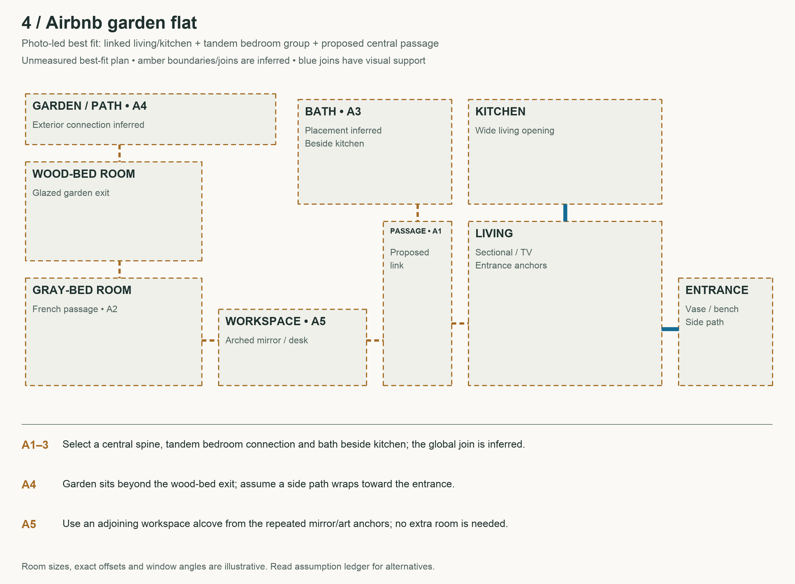
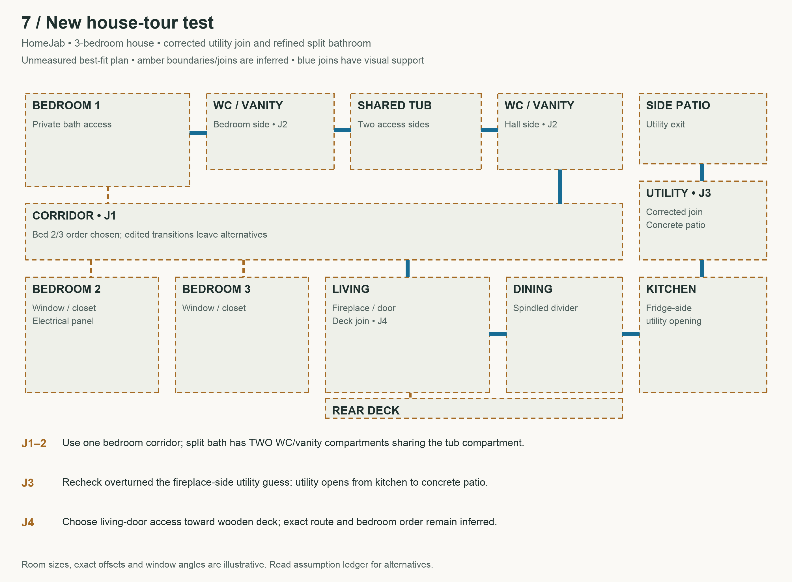

# Two additional walkthrough tests and seven best-fit layouts

The requested completion pass chooses one plausible arrangement for uncertain areas, retains alternatives, and challenges uncertain joins with further viewing. It is implemented as a documented agent workflow with evidence, assumptions and diagrams; it is not a fully automated reconstruction package.

## New sources

- [RentVision apartment walkthrough](https://www.youtube.com/watch?v=jQ9TiJwPxKw): 211.81 seconds, 171 extracted frame records actually viewed. Overview plus targeted 56–68, 84–99, 114–143, 142–160 and 164–181 second rechecks. The clubhouse/pool/gym segment after about 181 seconds is excluded from the unit plan.
- [HomeJab house tour](https://www.youtube.com/watch?v=GE1exIMYlGg): 128.09 seconds, 134 extracted frame records actually viewed. Overview plus 18–32, 44–82, 82–100 and 90–110 second rechecks; four native frame reopens clarify bathroom compartments.
- [Earlier Apartment Therapy studio](https://www.youtube.com/watch?v=_6z2SII3nHc): rechecked 155–177 seconds. Total now 68 viewed frame records. The folding Murphy bed is newly observed; the central window panel is a mirror. Bathroom access is still a chosen hypothesis.

Repeated timestamps across requests count as separate frame records, not unique moments. Frames were viewed in indexed contact sheets, with selected individual reopens. This is visual inspection, not full real-time audiovisual playback. No audio interpretation or external floor-plan ground truth was used. Titles were exposed; tests were not blinded.

## Frozen predictions and outcomes

| Prediction | Result | What changed or supported it |
|---|---|---|
| Apartment shared bath opens from hall | Supported | Bedroom → common hard-floor hall → separate bath door at 87–99 s. |
| Apartment second bedroom has own bath | Supported | Interior closet/bath entry and reverse bedroom view at 120–160 s. |
| Apartment laundry has common access | Supported | Bedroom return → living → separate laundry at 168–179 s. |
| House bedrooms share one corridor | Partly supported | Repeated corridor anchors; cuts still prevent exact bedroom order. Bath also has bedroom access. |
| House split bathroom shares tub/toilet zone | Refined | Two WC/vanity compartments connect through one shared tub compartment; toilets are in the outer compartments. |
| House laundry sits beside fireplace and leads to deck | Rejected and revised | Kitchen view at 44–48 s shows utility entry beside fridge; utility exits to concrete patio at 100–109 s. |

The six predictions were saved before targeted rechecks. The second house result preserves the original incorrect toilet placement rather than treating a partial match as a fully correct prediction. No numerical accuracy claim is made from these selected checks.

## Completed reasoning

27 layout choices cover all seven places. Each contains evidence IDs, rationale, an alternative, qualitative confidence and a check status. All 29 missing-view entries from the supplied videos also receive a chosen completion or a geometric placeholder. Missing camera calibration and coverage remain unset: deciding on a rear wall does not recover a camera pose or create observed imagery.

The studio bath goes at the kitchen/service end; the garden flat gets a central passage linking its photo groups; the suite's kitchenette and closet join a bath-side vestibule. These are selected low-confidence hypotheses, with alternatives retained. Hidden wall/floor surfaces continue the nearest observed planes. Closed doors get minimal access/storage volumes; unseen lower floors are not populated with invented detailed rooms.

No panoramas, 3D scenes or synthetic source views were generated in this pass. The new plans use deterministic Python/Pillow/SVG diagrams.

## Public-source diagrams

