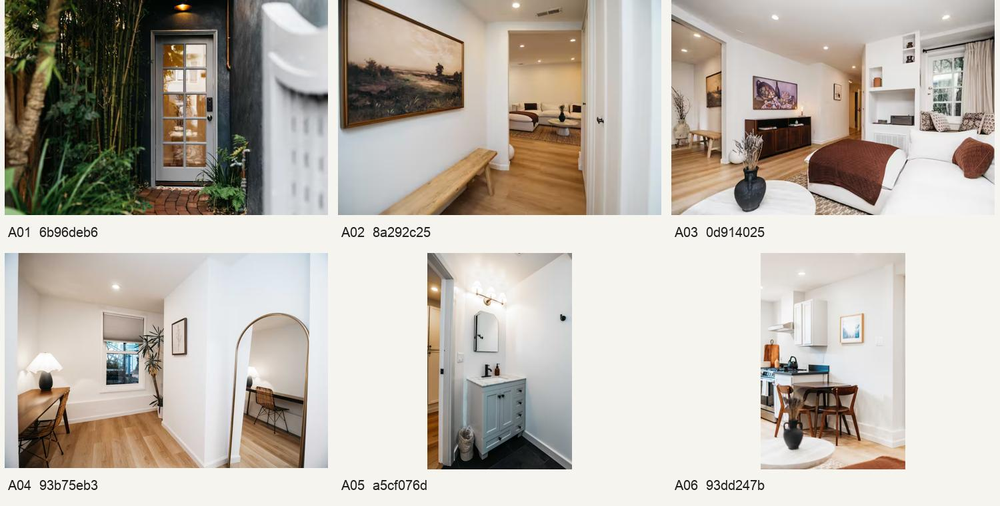
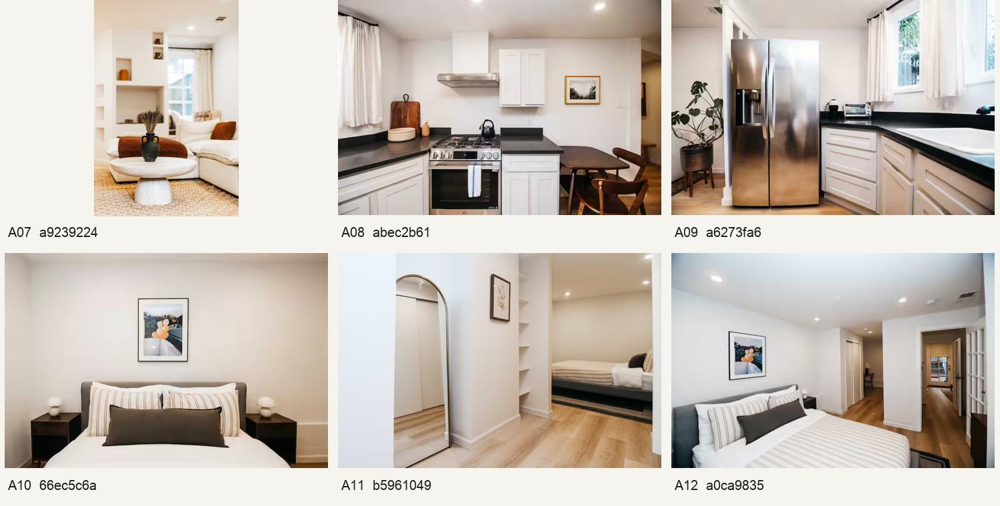
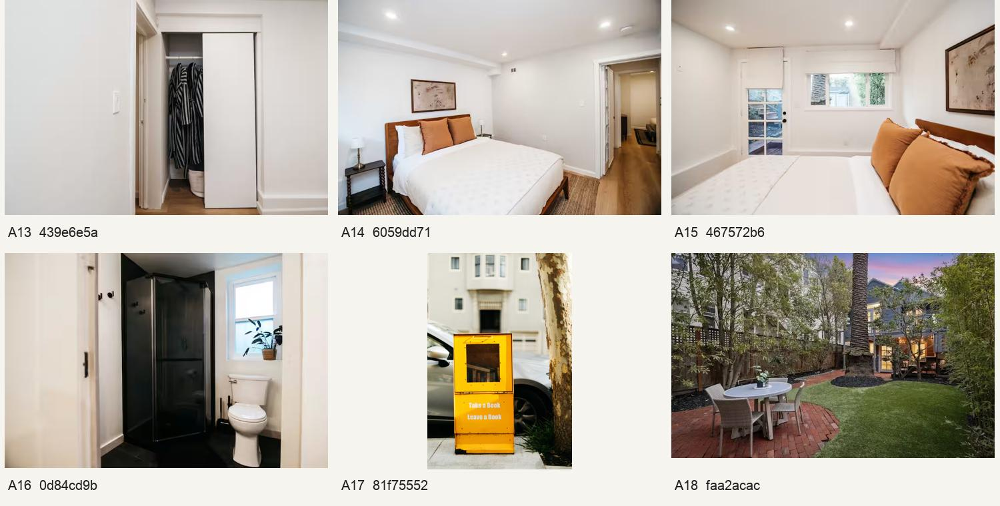
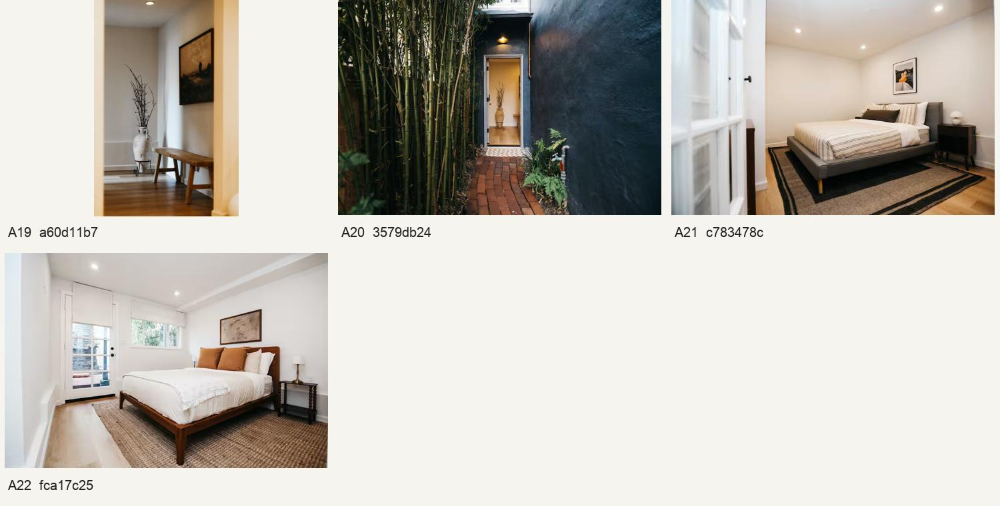
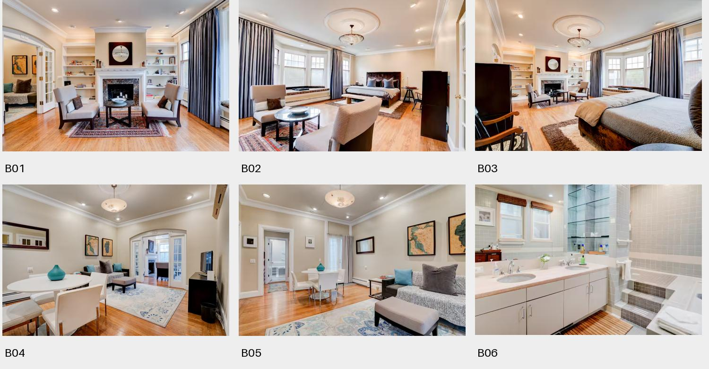
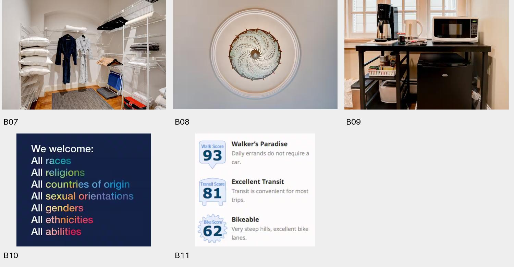

# All spatial experiments: videos and Airbnb photos

**Updated:** [Seven best-fit layouts and reasoning](best-fit-floor-plans.md). A later studio rewatch resolved the folding wall bed; the earlier three-video counts and unresolved labels below describe the initial pass. Two additional tours are now tested.

[New: floor-plan sheets for all five places](floor-plans.md)

[Repeatable workflow](reusable-spatial-workflow.md) · [Full Astra process log](astra-process-log.md) · [Published hackathon journal](https://github.com/abharw/astra2026/blob/Akeil/docs/BUILD_JOURNAL.md)

## 1. Your home walkthrough — IMG_7958 2.MOV

57.79 seconds. 122 viewed frame records, including repeat timestamps across requests; 13 individual reopens. Supports study → sitting → hall → bathroom/bedroom → dining → kitchen/utility. A denser recheck corrected the kitchen to the right when entering dining. Second study access and some room boundaries remain unresolved.

[Room-by-room findings](floor-plan-experiment.md) · [Tour points and missing views](guided-tour-plan.md) · [Tour JSON](guided-tour-data.json) · [Session manifest](evidence/7958/session.json) · [Actual command log](evidence/7958/actions.jsonl)

## 2. Your event-hall pan — IMG_7960.MOV

48.16 seconds. 59 viewed frame records; three individual reopens. Supports four named walls and one candidate pan station. Adjoining rooms, exact dimensions and full spherical coverage remain unknown.

[Wall evidence sheet](evidence/7960/r0002-s001.jpg) · [Reverse-pan sheet](evidence/7960/r0002-s003.jpg) · [Session manifest](evidence/7960/session.json) · [Actual command log](evidence/7960/actions.jsonl)

## 3. YouTube — Apartment Therapy studio tour

[Kim White’s studio tour](https://www.youtube.com/watch?v=_6z2SII3nHc). 182.72 seconds. 46 viewed records: overview plus two targeted wide-shot rechecks. Supports sofa opposite fireplace, window end and adjoining kitchenette. The tour is edited; bathroom access, entry and sleeping layout remain unresolved. The advertised area was not measured from video.

[Session manifest](evidence/youtube/session.json) · [Actual command log](evidence/youtube/actions.jsonl). The Architectural Digest candidate was found in search but was not analyzed.

## 4–5. Two Airbnb listings

[Full Airbnb findings](airbnb-experiment.md) · [Machine-readable relationships](airbnb-spatial-data.json)

The graph shows supported room connections, not measured room footprints. Solid links have direct visual support; dashed links are inferred. Unjoined groups remain unresolved. Listing text was exposed while browsing, so these were not blind image-only tests.

### Garden flat — all 22 inspected photos

[Source listing](https://www.airbnb.com/rooms/1586369805694396546) · [Manifest: individual images, source URLs and observations](airbnb-evidence/a/manifest.json)

Exterior → entrance → living → kitchen is well supported by matching vase/bench/art and wide openings. Bedroom/workspace links are partly inferred; bathroom access and global connections remain incomplete.

Individual rechecks: [A11 workspace/bed overlap](airbnb-evidence/a/A11.png), [A12 reverse passage](airbnb-evidence/a/A12.png), [A14 second-bedroom doorway](airbnb-evidence/a/A14.png).

### Pacific Heights suite — all 11 inspected assets

[Source listing](https://www.airbnb.com/rooms/18981477) · [Manifest: individual images, source URLs and observations](airbnb-evidence/b/manifest.json)

The fireplace sitting area and bed are in one room. French doors connect it to the sofa/dining room. A bathroom connection is supported by matching steps through a short passage; closet and kitchenette access are unresolved. Two gallery assets are informational graphics.

Individual recheck: [B05 bathroom approach](airbnb-evidence/b/B05.png).

## Evidence limits

No supplied video or photo set established a complete measured property plan. Audio was not verified. The source videos are not bundled. The later generated storyboard illustrates the proposed tour and is not part of the source-evidence set. All findings retain observed/inferred/unresolved distinctions; user ground-truth checks remain pending.
