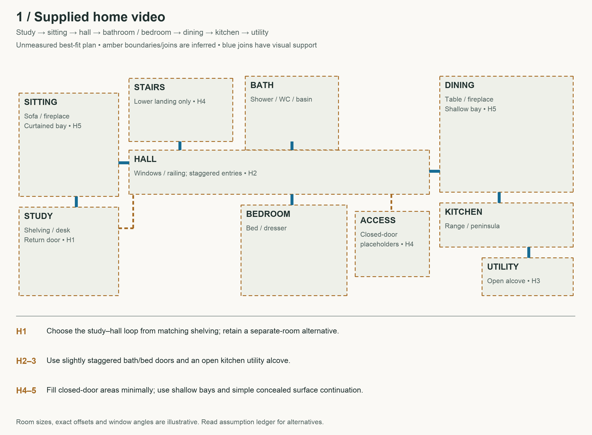
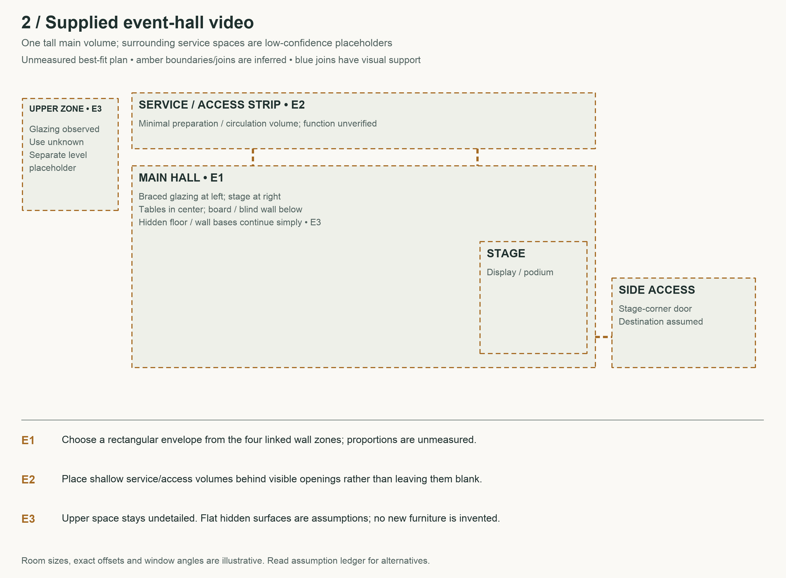
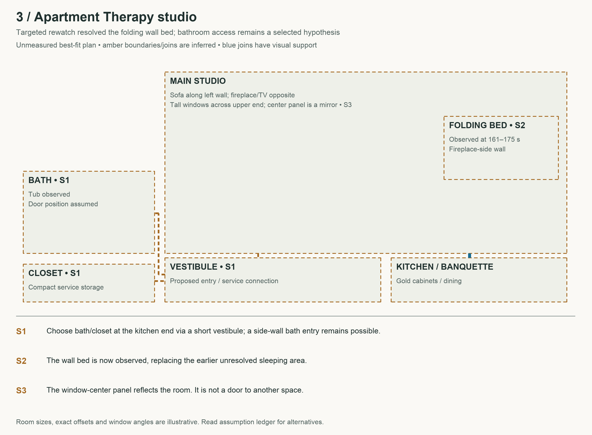
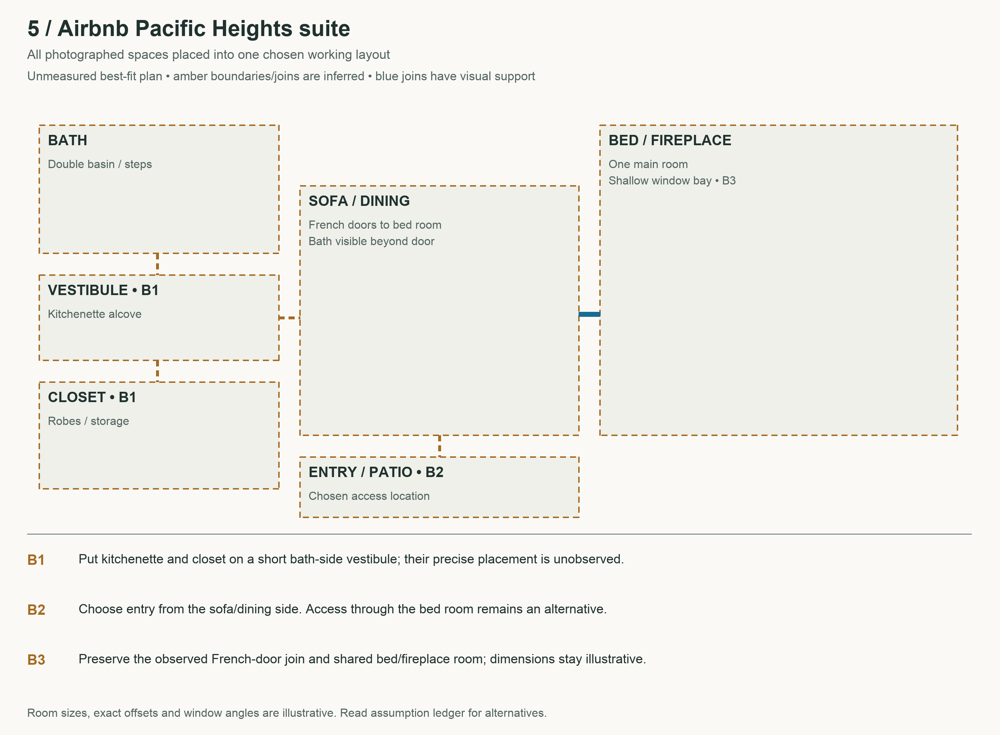
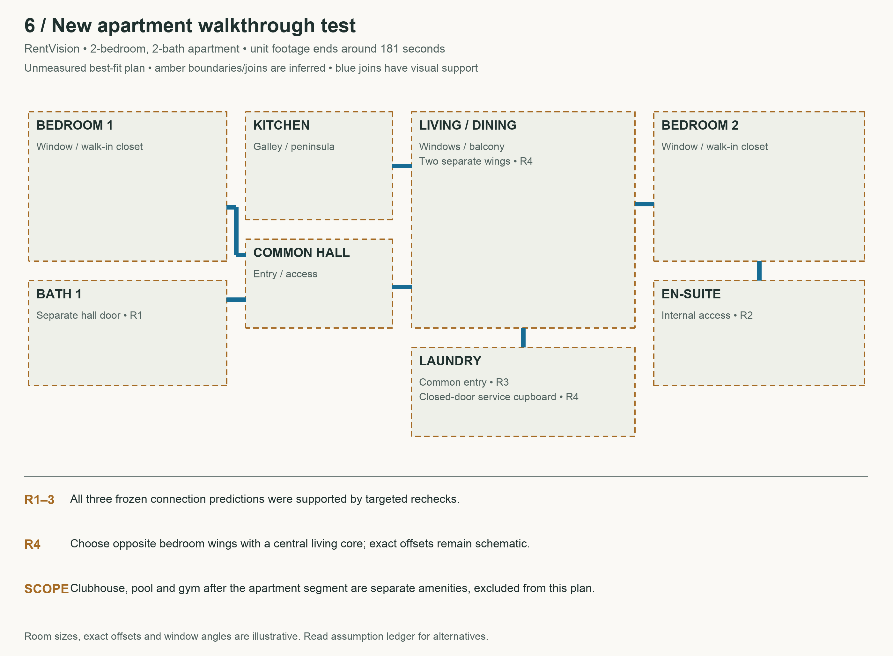

# Seven best-fit floor plans

Every previously unplaced area now has a selected spatial assumption or a minimal placeholder. Geometry remains illustrative. Blue connectors indicate visually supported access; amber connectors are chosen hypotheses. The original conservative plans remain available for comparison.

[Assumption ledger](best-fit-assumptions.json) · [Framework](reusable-spatial-workflow.md) · [New video test results](best-fit-tests/results.json) · [Original five plans](floor-plans.md)

## Home

[Editable SVG](best-fit-plans/home.svg)

## Hall

[Editable SVG](best-fit-plans/hall.svg)

## Studio

[Editable SVG](best-fit-plans/studio.svg)

## Airbnb Garden

[Editable SVG](best-fit-plans/airbnb-garden.svg)

## Airbnb Suite

[Editable SVG](best-fit-plans/airbnb-suite.svg)

## Rentvision Apartment

[Editable SVG](best-fit-plans/rentvision-apartment.svg)

## Homejab House

[Editable SVG](best-fit-plans/homejab-house.svg)

## Reasoning behind the choices

**H1 — The shelving doorway opens back into the starting study.** Matching shelving and lamp plus nearby route position. Confidence: moderate. Alternative: A second similarly furnished room. Check: Not tested: needs a linking view or owner confirmation.

**H2 — Bath and bedroom face a slightly staggered section of the same hall; other room outlines continue simply.** Opposite doorway approaches and a small camera turn favor staggered entries. Confidence: moderate. Alternative: A sharper hall dogleg with larger offsets. Check: Not tested: needs a linking view or owner confirmation.

**H3 — Utility is an open alcove beside kitchen, with no added dividing door.** Short pan shows appliance zone without a crossed door. Confidence: moderate. Alternative: A deeper enclosed utility room outside view. Check: Not tested: needs a linking view or owner confirmation.

**H4 — Closed doors lead to minimal storage/access volumes; stairs end in an undetailed lower landing placeholder.** Fewest invented spaces while allowing access beyond visible openings. Confidence: low. Alternative: Closed doors lead to additional full rooms; stairs reach a large lower floor. Check: Not tested: needs a linking view or owner confirmation.

**H5 — Use shallow three-sided window bays and continue concealed wall/floor planes.** Curtains and oblique window views suggest recesses, without calibrated angles. Confidence: low. Alternative: Flat glazing or a curved/deeper bay. Check: Not tested: needs a linking view or owner confirmation.

**E1 — Use one rectangular tall hall, stage opposite braced glazing.** Repeated pans link four wall zones. Confidence: moderate. Alternative: Slightly skewed perimeter or local wall recesses. Check: Not tested: needs a linking view or owner confirmation.

**E2 — Place a shallow access/preparation strip behind the service wall and a small access landing beside stage.** Door/counter positions permit a minimal service band. Confidence: low. Alternative: Doors open into separate larger rooms or exterior space. Check: Not tested: needs a linking view or owner confirmation.

**E3 — Use an undetailed upper access zone behind glazing; continue floor and wall bases behind furniture.** Upper glazing is visible; occupied function is not. Confidence: low. Alternative: Upper glazing belongs to separate offices or an exterior wall. Check: Not tested: needs a linking view or owner confirmation.

**S1 — Place bathroom and closet off a short service vestibule at the kitchen end.** Keeps exterior window end free and groups service functions with minimal circulation. Confidence: low. Alternative: Bathroom enters from a different side of the main room. Check: Not tested: needs a linking view or owner confirmation.

**S2 — Place the folding wall bed on the fireplace-side wall near the window end.** The deployment sequence directly reveals the bed. Confidence: high. Alternative: Earlier unresolved sleeping arrangement is superseded. Check: Observed in 161–175 s targeted rewatch; dimensions still inferred.

**S3 — Keep the center panel between windows as a mirror; use a simple rectangular studio footprint.** Reflected furnishings identify mirror; wide room views support simple envelope. Confidence: moderate. Alternative: A shallow wall offset or recess changes the envelope. Check: Not tested: needs a linking view or owner confirmation.

**A1 — A short central passage joins living to gray bedroom/workspace and bath.** Entrance/living anchors and bedroom openings permit one compact connecting spine. Confidence: low. Alternative: Separate branches or another unseen room intervene. Check: Not tested: needs a linking view or owner confirmation.

**A2 — Gray bedroom leads through the French-door passage to wood-bed bedroom.** Matching opposite bedroom views favor tandem connection. Confidence: moderate. Alternative: Similar doors connect each bedroom to a shared hall. Check: Not tested: needs a linking view or owner confirmation.

**A3 — Place bath beside kitchen, opening onto proposed central passage.** Unlinked bath photos require placement; compact wet-area grouping is a weak architectural prior. Confidence: low. Alternative: Bathroom sits beside bedrooms on the opposite side. Check: Not tested: needs a linking view or owner confirmation.

**A4 — Wood-bed glazed door leads toward garden; a side path returns to the main entrance.** Glazed exit and garden/path views fit this compact arrangement. Confidence: low. Alternative: Garden is reached from another door and paths do not connect. Check: Not tested: needs a linking view or owner confirmation.

**A5 — Workspace is an alcove adjoining gray bedroom.** Repeated arched mirror and botanical art link the views. Confidence: moderate. Alternative: Workspace is a separate room reached through a short hall. Check: Not tested: needs a linking view or owner confirmation.

**B1 — A short vestibule between sofa/dining and bath holds kitchenette and side closet.** Bathroom opening is seen beyond sofa room; unplaced service spaces fit a compact extension. Confidence: low. Alternative: Kitchenette and closet occupy separate branches of the suite. Check: Not tested: needs a linking view or owner confirmation.

**B2 — Entry/patio access joins sofa/dining opposite the French doors.** Keeps observed bed-to-sofa connection and provides a minimal independent entrance. Exterior graphics do not establish the join. Confidence: low. Alternative: Entry is through the bed room or bath-side vestibule. Check: Not tested: needs a linking view or owner confirmation.

**B3 — Use two main rectangles joined by French doors, with a shallow bay in the bed/fireplace room.** Shared fixtures and reverse views support two main volumes. Confidence: moderate. Alternative: Room edges contain additional recesses or larger offsets. Check: Not tested: needs a linking view or owner confirmation.

**R1 — Bedroom 1 and bath 1 open separately from common hall.** Recheck traverses bedroom-to-hall-to-bath. Confidence: high. Alternative: Bathroom is private to bedroom 1. Check: APT-1 supported by targeted recheck.

**R2 — Bedroom 2 has its own internal bath and walk-in closet.** Doorway sequence and reverse view place bathroom within bedroom approach. Confidence: high. Alternative: Bathroom enters from common hall. Check: APT-2 supported by targeted recheck.

**R3 — Laundry opens separately from common living circulation.** Return route leaves bedroom before entering laundry. Confidence: high. Alternative: Laundry opens within bedroom 2. Check: APT-3 supported by targeted recheck.

**R4 — Place bedroom wings on opposite sides of living; utility closed door leads to a minimal service cupboard.** Repeated living returns support separate wings; cupboard minimizes unsupported extra rooms. Confidence: moderate. Alternative: Wings have larger offsets; utility door leads to another access space. Check: Not tested: needs a linking view or owner confirmation.

**J1 — Use one corridor with bedroom 1 at its far end and bedrooms 2/3 on side branches.** Repeated trim and corridor views support one spine; edits leave exact order uncertain. Confidence: moderate. Alternative: Bedrooms 2 and 3 are swapped or offset on the same corridor. Check: HOUSE-1 partly supported; exact arrangement remains inferred.

**J2 — Shared tub compartment joins separate bedroom-side and hall-side WC/vanity areas.** Distinct toilets and through-door views resolve the split bath. Confidence: high. Alternative: One ordinary bath seen in reverse. Check: HOUSE-2 refined: toilets belong in outer compartments, not shared tub room.

**J3 — Utility opens from kitchen beside refrigerator and exits to concrete side patio.** Kitchen doorway co-visibility contradicts the original fireplace-side join. Confidence: high. Alternative: Initial fireplace-to-utility-to-deck guess. Check: HOUSE-3 contradicted and revised.

**J4 — Fireplace-side exterior door opens toward rear wooden deck; other hidden hall doors are shallow closets.** Exterior chimney/deck location fits living door; no continuous traversal establishes join. Confidence: low. Alternative: Deck is reached through another exterior route. Check: Not tested: needs a linking view or owner confirmation.
