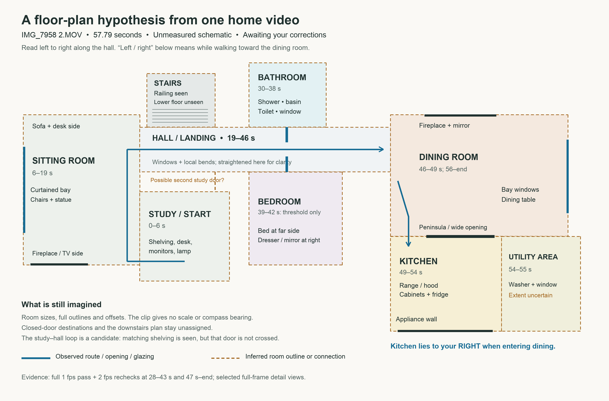
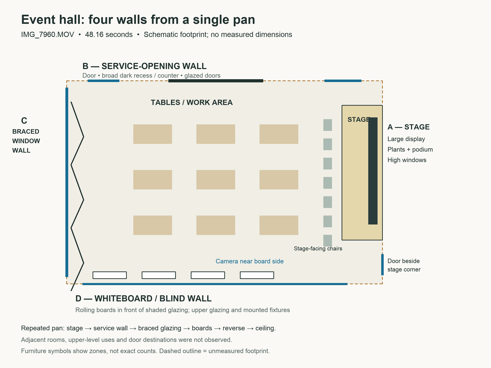
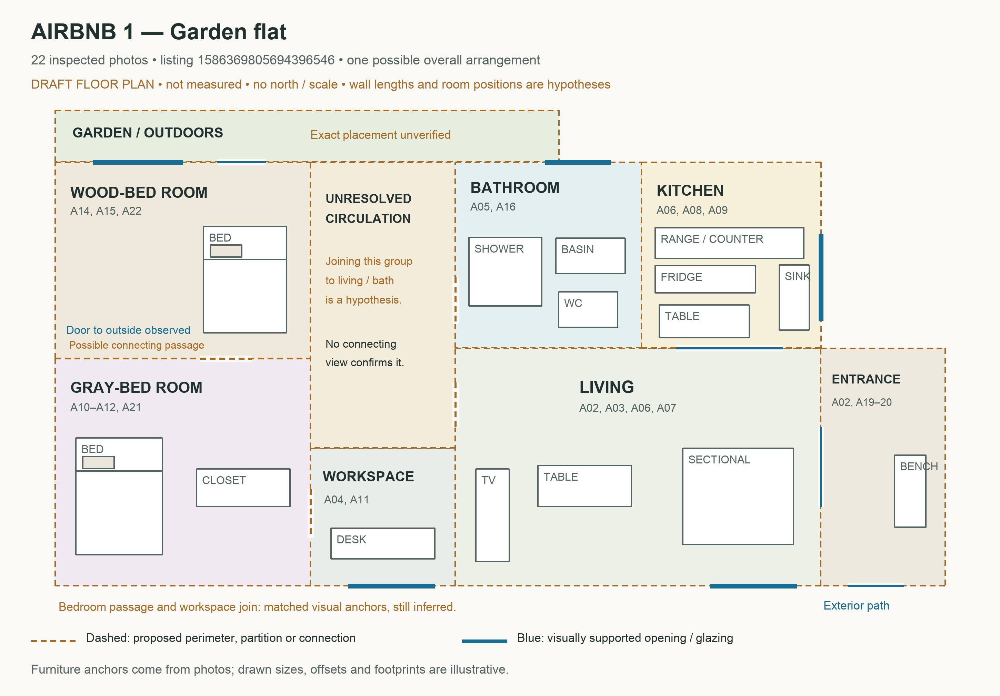
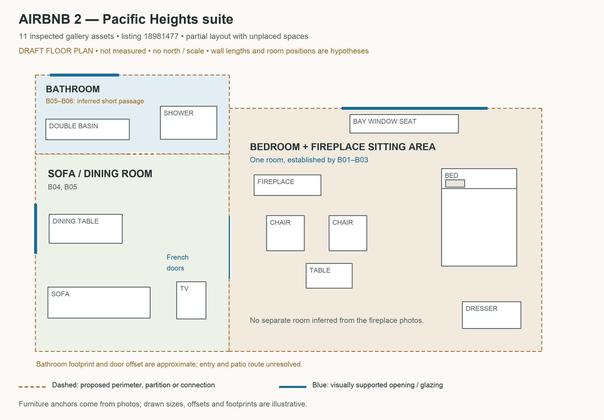
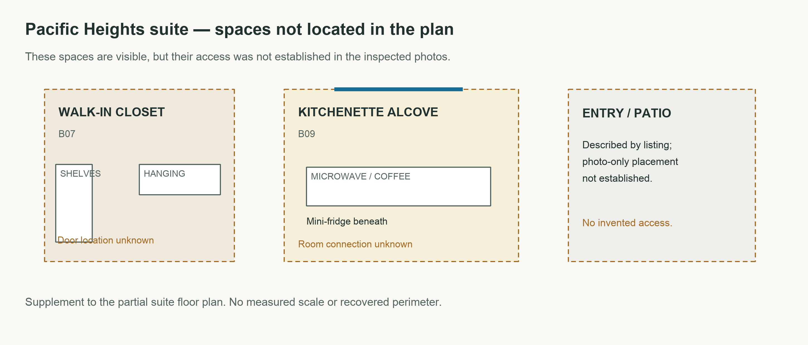

# Floor plans for all five analyzed places

**Updated:** [Seven best-fit layouts and reasoning](best-fit-floor-plans.md). A later studio rewatch resolved the folding wall bed; the earlier three-video counts and unresolved labels below describe the initial pass. Two additional tours are now tested.

These are spatial hypotheses, with illustrative room sizes and explicit unresolved areas. The Airbnb garden flat now has one possible full arrangement: its central circulation and global room positions are proposed, not recovered. The suite has a partial plan plus an inset of spaces that cannot yet be placed. No new source evidence was added to resolve those gaps.

## Home video

[PNG](home-floor-plan.png) · [Editable SVG](home-floor-plan.svg)

## Event-hall video

[PNG](hall-floor-plan.png) · [Editable SVG](hall-floor-plan.svg)

## YouTube studio

[PNG](youtube-spatial-hypothesis.png) · [Editable SVG](youtube-spatial-hypothesis.svg)

## Airbnb garden flat

[PNG](airbnb-garden-flat-floor-plan.png) · [Editable SVG](airbnb-garden-flat-floor-plan.svg)

## Airbnb Pacific Heights suite

[PNG](airbnb-pacific-suite-floor-plan.png) · [Editable SVG](airbnb-pacific-suite-floor-plan.svg)

## Suite: unplaced spaces

[PNG](airbnb-pacific-suite-unplaced-spaces.png) · [Editable SVG](airbnb-pacific-suite-unplaced-spaces.svg)

[Video evidence](floor-plan-experiment.md) · [Airbnb evidence](airbnb-experiment.md) · [Full review](all-experiments-review.md)
