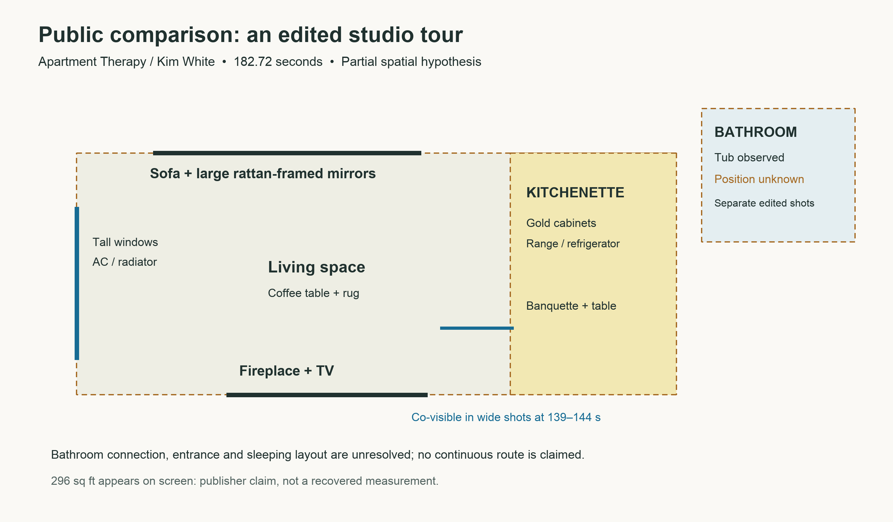

# Adaptive video-to-floor-plan experiment

September 8, 2026. Current-model investigation using the installed `agentic-video` skill. This is an experiment in spatial interpretation, not an implemented video-to-3D feature of the iPhone app.

## Question and design

Can Astra use one video to recover room connections and identify what occupies each wall, while keeping unseen geometry explicitly inferred?

The user supplied two videos. They were interpreted independently, without combining views: a 48.16-second event-hall pan and a 57.79-second home walkthrough. A public YouTube tour supplied a third, edited-video comparison. No external floor plan or listing was used as ground truth.

## Skill provenance

The local skill had been built in a previous session. The current session read its installed instructions, inspected its command implementation, and used its actual runtime. It reproduces an adaptive evidence-gathering pattern, not proprietary model training: decode an overview, view it, choose a narrower interval, rewatch, and record evidence-linked observations.

PyAV/Pillow and FFmpeg decode pixels and retain presentation timestamps. The current model interprets the images; no separate inference API was used. The prior session reported ten passing contract tests and blind/real-video validation. Those historical test results were not rerun here and are not the validation claim for this experiment.

## Actual investigation

1. Cloned the requested `Akeil` branch and read the existing journal.
2. Read `agentic-video/SKILL.md` and `references/tools.md`.
3. Initialized source-hashed sessions for each supplied MOV. Both were 3840 × 2160, approximately 24 fps, with HDR transfer metadata.
4. Requested and visually inspected chronological five-second overview sheets; marked only images actually viewed.
5. Requested and viewed a full one-frame-per-second pass at 1920-pixel extraction width for each source.
6. Reopened selected individual frames to inspect room openings, stairs, shelving, fixtures and the final dining/kitchen turn.
7. Revisited the home at 2 fps over 28–43 seconds for the bathroom/bedroom relationship and 47–57.79 seconds for dining/kitchen/utility continuity.
8. Asked the user to check the spatial hypothesis. Corrected the initial kitchen-left interpretation to kitchen-right after the denser rewatch; the journal preserves that error and its evidence.
9. Used computer-use browser controls to search YouTube, inspect the search page visually, and open a public comparison. Downloaded it with `yt-dlp` into local scratch storage and analyzed it with the same skill.
10. Created local schematic floor plans, a wall inventory, a proposed 3D completion strategy, and an evidence summary. Ran `status` for every session and checked extraction/viewing/truncation separately.

## Results and limits

| Input | Result | Evidence records viewed | Individual frame reopens |
|---|---|---:|---:|
| Supplied home walkthrough | Room/doorway hypothesis, wall inventory, and one corrected left/right interpretation | 122 / 122 | 13 |
| Supplied event-hall pan | Four wall identities, opposites, furniture zones and visible doorway locations | 59 / 59 | 3 |
| Public studio tour | Partial furniture/zone topology; edited shots leave bathroom access unresolved | 46 / 46 | 0 |

Frame records include repeated moments across requests. These counts are not continuous frame-by-frame viewing, an accuracy score, or a measured efficiency improvement. All requested contact sheets were viewed and all requests completed without truncation. The full 1 fps passes had maximum selected gaps of approximately one second; targeted 2 fps rechecks had gaps of approximately half a second. Audio was not verified. HDR color/exposure was not evaluated.

The home clip was better for doorway topology because it preserved the route. The hall repeatedly exposed the same wall anchors but never entered adjacent spaces. The edited public tour showed useful co-visible objects, but interview/detail cuts could not be treated as movement through doorways.

The local plan uses inferred footprints and arbitrary diagram scale. It leaves closed-door destinations, lower-floor geometry, dimensions, compass bearing and several unvisited wall extents unresolved. The 3D strategy remains a proposal: adjustable room volumes constrained by observed openings and wall anchors, with hidden completions labeled inferred. No mesh, camera-pose solution, LiDAR measurement or validated 3D reconstruction was produced.

## Public comparison

[Kim White’s Stylish 296 Sq Ft. Brooklyn Studio — Apartment Therapy](https://www.youtube.com/watch?v=_6z2SII3nHc) was found through YouTube computer use, downloaded, and inspected. Decoded duration: 182.7237 seconds.

A 36-frame overview plus rechecks at 8–13 and 139–144 seconds show a sofa against large rattan-framed mirrors opposite a fireplace/TV, tall windows at one end, and a gold-cabinet kitchenette with a dining banquette near the fireplace end. A bathroom/tub is visible in separate edited shots; its doorway relationship is unresolved. The 296-square-foot label is a publisher claim, not a recovered dimension.



[Architectural Digest’s 650-square-foot NYC apartment tour](https://www.youtube.com/watch?v=X_-Q1hOYeCo) was another visible search result. It was discovered only, not downloaded or analyzed. Finding a result is not video observation.

## Reproduce the method

Use the installed skill's launcher and separate sessions for separate sources. Replace paths with your own local authorized source and scratch directory.

```sh
video init /absolute/source.mov --session /absolute/work/session \
  --question 'Map room connections and wall contents; separate observed and inferred geometry.'
video scan --session /absolute/work/session \
  --purpose 'Locate stable wall anchors and room transitions'
# View every returned sheet before marking it.
video mark --session /absolute/work/session r0001-s001
video inspect --session /absolute/work/session --fps 1 --width 1920 \
  --max-frames 70 --purpose 'Follow the route from beginning to end'
# Subdivide longer sources rather than silently accepting truncation.
video inspect --session /absolute/work/session --start 28 --end 43 \
  --fps 2 --width 1920 --max-frames 40 \
  --purpose 'Resolve a doorway side or ambiguous turn'
# View and mark the actual new sheets/frames before creating claims.
video claim --session /absolute/work/session --kind observed \
  --text 'Only the relation actually supported by the inspected images' \
  --evidence THE_VIEWED_EVIDENCE_IDS
video status --session /absolute/work/session
```

The local output includes source hashes, exact PTS/request metadata, skill-file hashes, action logs, contact sheets and claim records. User-supplied footage, private detailed diagrams and raw frame evidence are retained locally, consistent with the repository's exclusion of private spatial captures.

## Human validation

A concrete layout question was sent during the investigation. Human ground truth remains pending. The most useful checks are the possible second study entrance, the relative bathroom/bedroom door offsets and the utility area's enclosure. The current deliverable is a reviewable first hypothesis; no user confirmation or geometric accuracy has been fabricated.
