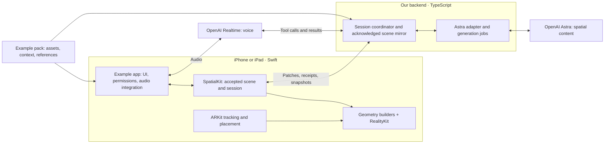

# Architecture

2026-09-08 · Proposed implementation architecture. The repository currently contains documentation; the SDK, app, and service described below are not implemented or benchmarked.

This file is the architectural overview. The detailed contracts are [asset generation and streaming](docs/asset-pipeline.md), [data formats](docs/data-formats.md), [storage and recovery](docs/storage.md), [device support](docs/devices.md), and [pointing](docs/gestures.md). [APPROACH.md](APPROACH.md) records the Arav/Astra collaboration in order.

## 1. Product and architectural decision

Build a framework for a continuous spatial conversation: **speak → generate something useful in AR → keep talking → reshape it**. The first application explores hardware architecture with a server rack. Schematic usefulness, responsiveness, and editability take priority over initial visual fidelity.

Use a small reusable SDK and one working example application. The SDK supplies a scene model, generic geometry capabilities, native execution, and session integration. The server-rack example supplies starting content and domain context. The backend session service is shared infrastructure. Here, “server rack” means the demo subject; “backend” means the service coordinating models and clients.

Start with one Swift package and one TypeScript service. Establish real dependency boundaries now; expand the public SDK API only when a second example demonstrates a need. A large collection of interfaces is not evidence of generality.

Target one universal native app for supported iPhones and iPads. Arav's **iPad Air M4 running iPadOS 26.5** is the primary demo target; his iPhone 15 Pro is the second test device. Share the SDK, renderer, backend and scene contract; adapt viewport/UI and verify both actual devices and the teammate-held setup. Pointing is required for the demo, even if it follows the first voice/generation slice. Arav chose screen-aligned pointing first; pinch and dragging remain optional.

## 2. Where generation and rendering happen

| Stage | Location | Responsibility |
| --- | --- | --- |
| Understand speech and deliver spoken responses | OpenAI Realtime; device audio integration in Swift | Conversational turn-taking and audio delivery |
| Decide what to create or change | GPT-6 Astra, called by our backend | Interpret intent and scene context; generate geometry descriptions, edits, and explanatory content |
| Normalize model output | Our TypeScript backend | Expand bounded composition, resolve aliases, assign identities, validate proposals and route complete batches |
| Validate and construct procedural geometry | iPhone/iPad, Swift | Turn bounded descriptions into mesh data/resources and entities |
| Apply changes to the live scene | iPhone/iPad, Swift | Check current state, install entities, manage selection, animation, cancellation, and undo |
| Save editable content | iPhone/iPad, concrete Swift storage component | Write accepted scene checkpoints to SQLite and retain original binary assets in app files |
| Track the device and place content | iPhone/iPad, ARKit | Relate virtual content to the camera and physical surroundings |
| Render the AR view every frame | Device GPU, through RealityKit/Metal | Draw the current scene using the latest tracked viewpoint |

**Cloud model inference is separate from cloud rendering.** In the initial design, the cloud sends descriptions and commands. The device produces pixels. Existing content keeps tracking and rendering while the model is thinking or the connection is slow. [ARKit](https://developer.apple.com/documentation/arkit), [RealityKit](https://developer.apple.com/documentation/realitykit).

Our TypeScript backend can initially run on the development Mac and later on a deployed host. OpenAI model inference remains remote in either case. This design does not require us to operate a cloud GPU renderer.

Keep RealityKit for the native iPhone/iPad AR loop. Three.js may shorten a browser 3D prototype, but standard browser AR support is a separate platform constraint. A browser inspector or Quest web adapter can reuse the scene contract later. Local pointing perception is required for the demo; a separate Neural Engine optimization effort is not. It remains distinct from cloud Astra inference and GPU rendering. See the [renderer and local-inference decision](docs/renderer-choice.md) for current sources, tradeoffs and evidence requirements.

There are two asset paths:

- **Authored asset:** bundle or download a hierarchical USDZ, then load and render it on the device. Preserve its separately addressable parts.
- **Generated content:** Astra produces a scene/geometry recipe; the device creates new meshes and entities. This includes new parts, schematic interiors, explanatory arrows, labels, and alternative arrangements.

Separate three representations: **model-authored source → normalized scene JSON → native mesh resources**. Astra can author small structured proposals directly or use short JavaScript programs through hosted Programmatic Tool Calling to construct proposals. Both enter the same validator and native compiler. The device receives concrete data, never generated executable code. Begin with direct structured tools and benchmark programmatic authoring before choosing its frequency. [Complete pipeline](docs/asset-pipeline.md).

For example, Astra can invent a heat sink using a base and twenty-four fins. The backend expands the layout into named nodes sharing one fin geometry definition; Swift constructs that mesh; RealityKit draws its instances. Spreading the fins changes transforms. Saving stores the accepted geometry recipe and nodes. Astra does not write SQL or generate each animation frame.

A future cloud geometry worker could produce a USDZ or other mesh artifact. That would move asset construction to a server, while frame rendering would still occur on the device. Streaming cloud-rendered video would be a different architecture and is outside this first implementation.

## 3. System boundary



The audio connection shown is the preferred WebRTC path. A backend WebSocket sideband coordinates Realtime tools. Native Swift transport must be proven in the first device spike; a WebSocket audio implementation may replace that transport without moving scene authority or geometry logic. [Realtime WebRTC](https://developers.openai.com/api/docs/guides/realtime-webrtc), [server controls](https://developers.openai.com/api/docs/guides/realtime-server-controls).

## 4. Proposed repository structure

Create these directories as their implementation arrives. Only the Markdown files exist today.

```text
architecture.md                        # Current architectural decisions
APPROACH.md                            # Chronological Arav/Astra collaboration log
RESEARCH.md                            # Research background and primary sources
docs/                                  # Detailed pipeline, format, and storage contracts
contracts/
  scene.schema.json                    # Wire format; independent of language/provider
  fixtures/                            # Shared accepted/rejected examples and expected states
packages/SpatialKit/
  Package.swift
  Sources/SpatialCore/                  # Values, validation, patch rules, undo records
  Sources/SpatialApple/                 # Session client, scene controller, AR/RealityKit adapter
    Storage/                           # Concrete SQLite checkpoints and artifact files
  Tests/
services/session/                      # One TypeScript service
  src/transport/                       # Client connection and Realtime coordination
  src/astra/                           # Responses, tools, streaming, steering
  src/authoring/                       # Proposal normalization, aliases and bounded expansion
  src/session/                         # Jobs, cancellation, acknowledged scene context
apps/ios/                              # Universal iPhone/iPad SwiftUI app and composition root
examples/server-rack/                   # Initial asset, semantics, references, domain context
evidence/                              # Actual runs, timings, artifacts, failures and fixes
```

`SpatialKit` is a working package name. The initial SDK can be consumed by an app in this repository through Swift Package Manager; packaging it for third-party distribution comes after the end-to-end loop works.

### Dependency and ownership rules

| Component | Owns | Dependency boundary |
| --- | --- | --- |
| `SpatialCore` | Scene values, geometry recipes, validation, pure state transitions, receipt types | Foundation/value types; no RealityKit, ARKit, SwiftUI, OpenAI, or rack-specific concepts |
| `SpatialApple` | Native session client, applied scene controller, entity mapping, geometry construction, AR surface, selection and local storage | Depends on `SpatialCore`; contains Apple, transport and SQLite integration in separate internal components |
| iPhone/iPad app | Adaptive UI composition, experience selection, permission UX, audio session/library lifecycle, capture controls | Configures the SDK and voice connection; contains no geometry algorithm or model prompt orchestration |
| Backend | Credentials, model connections, prompts/tools, pending jobs, cancellation routing, acknowledged scene mirror | Depends on the contract and example context; contains no Apple entity types or rack-specific command routing |
| Example pack | Seed assets, component roles, optional reference material, domain context | Ordinary files/data loaded by app/backend; no custom scene executor |

Keep concrete types and small modules. Do not add a provider/plugin registry, generalized workflow engine, or rendering abstraction hierarchy before a demonstrated consumer needs it. OpenAI-specific behavior belongs in the backend adapter so the portable scene format does not depend on a provider SDK.

### SDK consumer surface

An app supplies an experience manifest and backend endpoint, creates a native spatial session, and embeds its AR surface. The session exposes a scene snapshot and events for selection, installation receipts, connection state, and tracking. It accepts cancel, reset, and undo-last-change actions. These are proposed capabilities, not existing API signatures.

The app integrates the selected audio library and its lifecycle; the session service coordinates voice tools. `SpatialApple` keeps session networking, scene control, and geometry construction in separate internal types within the same target. A new example should require a different pack and app configuration, without copying those types or writing a renderer.

## 5. What makes this a framework

The reusable mechanism is **intent + current scene → new spatial content → validated execution → conversational revision**. It must operate on newly generated nodes as well as imported ones.

A content pack contains a manifest, optional seed geometry, semantic metadata, and source references. It can set domain context such as “explore hardware architecture.” It must not supply phrase-to-animation mappings, predetermined narration, or a special `show_cooling_demo` operation.

The geometry vocabulary starts with generic shapes, materials, transforms, repeated instances, lines/tubes, arrows, and text. Add bounded custom meshes or extrusion when a useful output needs them. Astra selects parameters, composition, names, relationships, and edits at runtime. Native code implements the general construction algorithms.

Use one representation for imported and generated nodes: stable ID, parent, local transform, geometry reference, material reference, semantic description, and provenance. Geometry definitions are immutable and independently reusable. Editing one node's geometry creates/reuses a new definition and changes that reference; it must not unexpectedly alter other nodes sharing the old geometry. Distinguish origin (authored/generated) from factual support (reference-based/illustrative). Neither authored nor generated automatically means accurate.

**Generality test:** load a second small example, such as a desk fan, and generate/revise content using the same app, backend, and operations. No change to framework source should be needed. This is the first evidence for SDK reuse; a production SDK is a later claim.

## 6. Contract and state authority

The active iPhone or iPad owns the **accepted semantic scene** for its session. `SpatialApple` holds that state and the native entity mapping; `SpatialCore` defines its transitions. The backend holds the latest acknowledged mirror for model context. The RealityKit entity tree is a rendered representation, not a second semantic database.

The same ownership applies when running on iPad: the active native client is authoritative. References to the device in the earlier pipeline descriptions apply to either supported device; an iPad does not introduce a second scene owner.

| Identifier | Meaning |
| --- | --- |
| `documentId` | Stable saved-document identity across launches, introduced with Save/Open |
| `sceneId` | Identifies this scene instance; changes when a new scene session begins |
| `revision` | Increases for each committed scene transaction, including undo |
| `intentEpoch` | Invalidates uncommitted work superseded by a new user intent |
| `requestId` | Deduplicates delivery of one exact transaction |
| `generationId` | Correlates the pieces of a generated assembly |
| `nodeId` | Stable identity for a selectable/imported/generated component |
| `geometryId` | Immutable geometry-version identity; separate from node identity and content hash |

The connection handshake carries `protocolVersion`, supported scene-schema and geometry-semantics versions, and geometry/operation capabilities. Reject an unsupported version before accepting commands; do not guess compatibility. Versioned UTF-8 JSON with JSON Schema 2020-12 is the application contract; provider tool schemas are separate adapters. Swift `Codable` types and TypeScript types/validators must conform to the contract using shared fixtures. Syntax validation is insufficient: enforce semantic references, acyclic hierarchy, finite numbers, valid indices, and resource limits on the device before native APIs receive data.

Use metres, a documented right-handed +Y-up model space, explicit local transforms/pivots, and a separate root-placement transform. All updates address semantic IDs, never RealityKit object references. Store desired/rest poses so repeated manipulation and undo do not drift.

Core operations: create/remove node, replace geometry, set transform, set material/visibility, annotate/highlight, and undo the latest committed transaction. Existing-scene edits carry `sceneId`, strict `baseRevision`, `intentEpoch`, and `requestId`; generation batches use the restricted scope below. Updates describe absolute target state where practical. Asset references resolve through known handles rather than model-provided executable code. Runtime code assigns transport fields from the request's immutable admission record; a delayed output must never inherit a newer epoch merely because session state has advanced.

### Installation boundary

1. Check the request ID first. A retry of the same payload returns its prior receipt; reuse with a different payload is an error.
2. Validate what can be checked against a scene snapshot and prepare immutable resources without changing the visible scene. Preparation may run in parallel; it cannot establish that a snapshot remains current.
3. Before installation, recheck scene ID and epoch plus the applicable precondition: strict base revision for an edit, or active scope, ownership and expected sequence for a generation batch. Work may have been superseded during asynchronous preparation.
4. Apply the operations to the current accepted scene and commit the resulting state/native changes in a serialized, bounded step without an intervening `await`. Never replace it with a whole-scene candidate captured before preceding batches committed. Reject failed validation/preparation without changing the existing scene.
5. Increment the revision and return the affected IDs and resulting state summary. Record animation completion separately.

`installed` means native entities and semantic state were updated; it is not proof of a physical display frame. Use actual capture/frame evidence when reporting time to first visible geometry. Narration may describe installed content, but must not claim a pending build or failed patch succeeded.

Streaming means complete, independently useful components or batches. Never mutate the scene from incomplete JSON/tool arguments. A `generation.begin` checks `initialBaseRevision` once and grants one generation-owned subtree. The backend may pipeline complete batches with increasing sequence numbers; the device commits them in order and increments the global revision for each commit. A later batch's dependencies must have committed before that batch can install. It need not wait for a receipt to travel back to the cloud before being sent.

V0 permits one authoring scope at a time. It may address its own nodes and approved anchors; competing semantic mutations revoke it before changing the scene. Ordinary existing-scene edits retain strict revision checks. Enforce immutable retries, bounded queues, retransmission and a deadline for sequence gaps. `generation.finish(lastSequence)` completes only after all declared batches install. This is restricted ownership, not automatic rebasing. [Stream protocol](docs/asset-pipeline.md#5-progressive-generation-without-a-round-trip-per-component).

## 7. Voice, Astra, and correction flow

Use `gpt-realtime-2.1` for audio conversation and `gpt-6-astra` through Responses for geometry, spatial reasoning, and substantive explanations. Astra has text/image input and text output; its documented modalities do not include audio. [Astra model](https://developers.openai.com/api/docs/models/gpt-6-astra), [Realtime model](https://developers.openai.com/api/docs/models/gpt-realtime-2.1).

For “show how air moves through this”:

1. The app supplies current selection, scene revision/epoch, and semantic context; optional images include the rendered virtual content.
2. Realtime forwards the request to the backend bridge. The bridge attaches authoritative context rather than asking the voice model to invent node IDs.
3. Astra proposes a useful spatial explanation and emits complete geometry/scene operations.
4. The client builds and installs accepted chunks. Receipts update the backend mirror and Astra context.
5. Realtime delivers Astra's explanation grounded in those results. Astra can attach a cue to a proposal; application code binds it to installed nodes or completed animation operations and releases it when those prerequisites hold. Predictable success does not require another Astra call solely for narration. Actual audio playback must also respect cancellation and current state.

The bridge remains receptive while earlier work is pending. Never block new speech intent behind a long-running tool handler. Audio interruption, model steering, geometry cancellation, and scene undo are different actions.

On detected speech start, provisionally pause pending installations and interrupt audio playback. Bind the subsequent resume/supersede decision to that speech turn; ignore an older turn's decision. A confirmed scene-changing correction advances the client's intent epoch before replacement work is admitted. A non-mutating turn such as “yes” or a factual follow-up can resume compatible pending work after state revalidation. While the decision is unresolved, installation stays paused. A bounded hold deadline ends unresolved work by cancellation, never automatic resume.

Already accepted parts remain. The next request can retain, revise, or undo them. Old jobs may still finish computing, but old-epoch proposals cannot install. Reusing useful output requires an explicit current-state proposal. A local Stop control advances the epoch immediately and cancels pending installation independently of network latency.

The backend forwards corrections through Astra's Responses WebSocket steering and cancels obsolete application jobs as appropriate. Steering acceptance only means queued input: it does not undo scene changes or cancel already-started tools. Async tools allow Astra to continue working while application jobs run; our service remains responsible for those jobs and returning correlated tool results. [Steering](https://developers.openai.com/api/docs/guides/steering), [async tools](https://developers.openai.com/api/docs/guides/async-tool-calling).

Programmatic Tool Calling and async tools have different protocols: PTC tools cannot be async. The direct async emitter returns one final installation/rejection result. A programmatic proposal may return `pending` promptly, closing that tool call; its eventual installation receipt is a separate application event. Both feed the same internal pipeline. Preserve required caller/continuation metadata and never send two results for one completed tool call. [Authoring adapters](docs/asset-pipeline.md#3-the-two-authoring-paths).

## 8. Swift execution and native responsibilities

Use value types and explicit states for protocol data and scene transitions. Keep `SpatialCore` independent of actor scheduling; the native controller serializes scene commits on the main actor. Network waits use structured asynchronous code. Move pure numeric preparation away from the UI only where profiling justifies it, passing immutable values across isolation boundaries.

RealityKit mesh resources and native scene APIs have actor requirements. Do not assume that declaring an operation `async` moves mesh creation off the main actor. Bound resource creation/insertion and measure its effect on frames. Start with `MeshDescriptor`; use `LowLevelMesh` if frequent deformation later warrants it. [MeshResource](https://developer.apple.com/documentation/realitykit/meshresource), [MeshDescriptor](https://developer.apple.com/documentation/realitykit/meshdescriptor), [LowLevelMesh](https://developer.apple.com/documentation/realitykit/lowlevelmesh).

Use asynchronous full `Entity` loading for authored assemblies. Apple's model-loading helpers flatten the hierarchy, which would remove the component boundaries needed for deconstruction. [Entity loading](https://developer.apple.com/documentation/realitykit/loading-entities-from-a-file).

The app owns the native audio session, route changes, permissions, and interruption lifecycle even when a library implements WebRTC. If using WebSocket audio, the client must also account for actual playback and conversation truncation. Select and pin the native transport dependency only after a real-device voice spike. [AVAudioSession](https://developer.apple.com/documentation/avfaudio/avaudiosession), [Realtime interruption](https://developers.openai.com/api/docs/guides/realtime-conversations#interruption-and-truncation).

## 9. Failures and recovery

- **Invalid geometry:** reject the patch, keep the previous scene, and return an actionable error for a fresh proposal.
- **New intent during preparation:** fence the old epoch before installation; discard its uncommitted candidate.
- **Lost receipt:** retry the exact request ID; the client deduplicates within this scene session.
- **Connection loss:** keep the last installed scene interactive and show disconnected state. On reconnect, send a fresh client snapshot and reconcile outstanding jobs; do not replay unacknowledged mutations blindly.
- **App restart:** the first in-memory spike starts empty. Once Save/Open exists, restore the last saved normalized checkpoint under a new scene ID, rebuild resources, and request physical re-placement. Latest unsaved changes may be lost; old jobs remain invalid.
- **Tracking loss:** preserve semantic content, surface tracking status, and offer explicit re-placement without pretending the physical anchor is reliable.
- **Partial progress and undo:** keep accepted chunks; cancellation stops future commits. V0 undo reverses only the latest committed transaction after superseding pending generation. It creates a new revision and is rejected if the required prior state is unavailable. A streamed assembly can span several transactions; restoring an older assembly is a separately validated scene edit, not arbitrary application of historical inverses.

Save/Open uses local SQLite checkpoints plus durable source-asset files. Keep native/GPU resources as derived state. Installation does not wait for storage: `installed`, `checkpoint_saved`, animation completion, and captured-frame evidence are separate facts. The accepted in-memory scene may be newer than its saved checkpoint. A backend scene mirror, provider conversation history, and prompt cache do not substitute for saved documents. [Storage contract](docs/storage.md).

## 10. What a judge should be able to verify

| Question | Inspectable evidence |
| --- | --- |
| Did Astra create this at runtime? | Actual model/response IDs, live geometry recipe, resulting artifacts and receipts |
| Can a person redirect it? | Deliberately delayed build, conflicting spoken correction, and proof no obsolete geometry installs |
| Does pointing work in the demo? | Screen-aligned finger targeting of a newly generated part, a spoken follow-up bound to that ID, and correct resulting explanation/edit |
| Is generation editable? | Select a newly created node, revise it, and leave unrelated nodes unchanged |
| Can the result be inspected and reopened? | Saved normalized JSON, generation provenance, artifact hashes and reconstruction without a model call |
| Is this a reusable framework? | Second content pack operating without changes to SDK or backend source |
| Are voice and scene truthful? | Failed/rejected patch trace, correct narration, distinct installed/animation-complete states |
| Is AR real? | Real-device placement, walk-around, selection and tracking evidence |
| Is the system responsive? | Utterance end, model call, first valid chunk, mesh preparation, installation and visible-result timings; sample counts and failures |
| How did Arav and Astra build it? | Sequential collaboration log linked to code, decisions, and actual validation as they happen |

Test meaningful boundaries: schema conformance across Swift/TypeScript; stale revision/epoch and duplicate handling; malformed geometry; generation interrupted during preparation; undo; and renderer integration on the device. A screenshot alone does not prove these behaviors. Keep evidence sanitised for a public repo and preserve asset provenance.

## 11. Implementation order and Quest

1. Prove signed AR rendering and live voice separately on the available native device; verify both model APIs. Connect the iPad Air M4 and run an early screen-aligned pointing feasibility trial on iPadOS 26.5.
2. Define the minimal contract and shared fixtures; build one local geometry recipe and a failed-patch path.
3. Connect Astra direct structured output to that exact execution path, then add receipt-grounded speech. Compare short programmatic authoring using the same execution path.
4. Implement correction/epoch handling and test a delayed obsolete job.
5. Integrate required screen-aligned pointing with voice targeting; verify the iPad demonstration setup and shared iPhone behavior.
6. Add the rack seed and both deconstruction/generated-content paths; collect unfamiliar follow-ups.
7. Add Save/Open checkpoints, then coalesced autosave; verify unsaved/crash behavior separately from installation.
8. Run a second small content pack to test generality, then prepare the demo and development evidence.

A Quest client can reuse the wire contract, semantic content, generated recipes, service, and fixture expectations. It needs a new native runtime/renderer and input mapping, likely Unity/OpenXR. Coordinates, materials, picking, tracking and audio need platform-specific verification. A Swift package does not make the renderer portable by itself.

The first implementation acceptance target remains one useful, interruptible voice-to-generation loop on a supported native device. Full demo acceptance additionally requires screen-aligned pointing. Visual fidelity, cloud asset baking, broad SDK distribution, and Quest execution can expand after that result exists.

**Required demo milestone: point and speak.** A stable fingertip target is highlighted in the camera view and bound to the next spoken request, such as “explain this.” Pinch confirmation and constrained dragging are optional extensions. Keep touch/reticle input available, but they do not substitute for pointing acceptance. Recognition remains a local input adapter using the same scene executor. See [pointing interaction and acceptance](docs/gestures.md).
