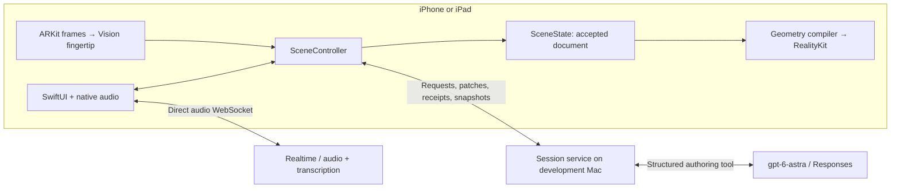

# Architecture

Astra Spatial is a universal iPhone/iPad app for exploring editable 3D structures through conversation and pointing. The rack is example content. The reusable code is a scene reducer, procedural geometry compiler, native renderer, and input adapters.

## Code boundaries

| Directory | Responsibility | Does not own |
| --- | --- | --- |
| `apps/ios/SpatialDemo` | Product controls, permissions, audio/Realtime lifecycle, app composition | Geometry algorithms or model prompts |
| `packages/SpatialKit/Sources/SpatialCore` | Scene values, validation, immutable request hashes, pure transactional reducer | Apple graphics, network connections, server hardware knowledge |
| `packages/SpatialKit/Sources/SpatialApple/Rendering` | Mesh/material compilation, entity hierarchy, AR/preview surfaces | Semantic scene authority |
| `packages/SpatialKit/Sources/SpatialApple/Input` | Touch selection and camera-fingertip mapping, dwell and speech locks | Model inference or geometry edits |
| `packages/SpatialKit/Sources/SpatialApple/Transport` | Native scene WebSocket and session envelopes | Model prompting |
| `packages/SpatialKit/Sources/SpatialApple/Storage` | Manual SQLite document checkpoints | Autosave policy or GPU resources |
| `services/session` | OpenAI credentials, Astra authoring, proposal normalization, acknowledged scene mirror | Native entity state or rendering |
| `examples/server-rack` | Authored starting assembly, component descriptions and references | Special rack commands or a separate executor |
| `tools/SceneLab` | Seed generation and headless live-model acceptance using the production reducer | Rendering or camera testing |
| `tools/PointingReplay` | Synthetic input replay using the production pointing resolver | A second product app, Vision inference, or a renderer |

`SpatialApple/SceneController.swift` connects the native collaborators and serializes scene installation. It is the device-side coordinator, not another framework layer. The Swift package has only two library targets: `SpatialCore` and `SpatialApple`.

## Product app versus test tools

There is no separate iOS harness implementation. `apps/ios` is the real application. On hardware it uses the AR camera; in Simulator it uses RealityKit's non-AR surface. The reducer, compiler, networking, and controls are shared. Simulator cannot prove camera tracking or physical pointing.

The former Mac harness is a command-line pointing replay in `tools/PointingReplay`. It supplies synthetic landmarks and a two-region hit-test stub to the same mapper/resolver that the app uses, then checks the results. It needs no camera or second scene implementation. `tools/SceneLab` separately proves the real backend-to-Swift contract without a renderer. [Testing and evidence boundaries](docs/testing-harness.md).

## Current runtime flow

The app receives a final voice transcript and sends it through the same scene request path as typed text. Realtime does not independently mutate the scene. The backend provides an ephemeral Realtime credential; the OpenAI API key stays in its process.

A request runs as follows:

1. **Choose the subject locally.** Touch selects a semantic node. Hand mode maps a Vision fingertip through its ARFrame display transform, hit-tests RealityKit, and requires stable hover. Speech onset captures that target; later pointer movement cannot retarget the request.
2. **Admit the intent.** On a submitted text request or final transcript, the device advances its intent epoch, sends the fence/current snapshot, and submits the text plus selected IDs. The backend calls Astra with that acknowledged scene.
3. **Author a bounded proposal.** Astra returns one structured `propose_scene` call: either an explanation, a new assembly, or edits. The backend resolves aliases and assigns IDs/hashes. Invalid proposals get one bounded repair before device delivery.
4. **Validate and install.** The device applies the proposal to a copy of the pure reducer, prepares native resources, rechecks the current scene/epoch/revision, and installs the accepted semantic state and native entities in one serialized step. Invalid work leaves the scene intact.
5. **Acknowledge and explain.** The device sends receipts and a snapshot. After acceptance, the service releases the explanation. The app displays it and, if voice is active, asks Realtime to speak it with state/epoch gating.

Current cancellation occurs on submitted requests, Stop, and Undo. Speech onset interrupts playback and captures selection, but does **not** yet pause pending scene installation while the person is still speaking. The HTTP Responses adapter uses streaming transport but waits for complete tool arguments; true progressive installation, Responses steering, PTC, and an audio WebRTC sideband are not implemented.

## Generation, rendering, and persistence

**Astra generates structured geometry descriptions. Swift constructs meshes. RealityKit renders frames on the device GPU.** Cloud model inference does not mean cloud rendering.

The implemented vocabulary is box, sphere, cylinder, cone, tube, and arrow recipes; named nodes reference shared immutable geometry and materials. Parent/child relationships preserve assemblies. Moving an assembled server changes its parent transform; moving a fan changes that component's transform. Neither operation requires regenerating the mesh. Visibility can reveal the interior; Undo restores the latest accepted transaction.

The normalized scene is versioned UTF-8 JSON with metres, +Y-up coordinates, quaternion rotations, stable node IDs, semantics, and source provenance. Wire JSON and typed canonical hash bytes are intentionally different representations. The provider tool schema is an adapter, not the public scene contract. [Exact formats](contracts/README.md) · [Representation rationale](docs/data-formats.md).

The active device's `SceneState` is authoritative. RealityKit entities are a derived projection; the service's acknowledged mirror is model context. SQLite saves normalized documents through manual checkpoint APIs. App Save/Open controls, autosave, imported binary assets, and restoration of real-world anchors are future work. [Storage](docs/storage.md).

The current seed is bundled directly from `examples/server-rack/scene.json`; there is no duplicated app copy or special phrase-to-animation route. Geometry detail and sourced component names belong in that example. A live fan-generation acceptance run already uses the same contract without rack-specific code, although a public third-party SDK is not yet packaged.

## Why this stays editable

- A semantic component has its own stable node identity, parent, transform, role, and provenance. It is not inferred from a flattened rendered mesh.
- The reducer enforces references, hierarchy, finite values, budgets, strict revision/epoch checks, generation ownership, and immutable retries.
- Geometry resources are cached and shared; a transform edit preserves native entity identity.
- Selection and spoken-request locks are local UI/input state. They do not create scene revisions.
- A successful installation receipt means native entities were installed. A screenshot or measured frame is separate evidence that they became visible.

A later Blender worker can generate an immutable hierarchical USDZ plus component mapping, which the phone downloads and loads asynchronously. It must preserve named parts to support live deconstruction. That is an additional asset compiler; the interaction/render loop remains local. No Blender worker, USDZ importer, or live Blender bridge exists in this implementation. [Asset pipeline and deferred extensions](docs/asset-pipeline.md).

## Read the code in order

1. [App entry](apps/ios/SpatialDemo/SpatialDemoApp.swift) and [app session](apps/ios/SpatialDemo/DemoSessionModel.swift).
2. [Scene coordinator](packages/SpatialKit/Sources/SpatialApple/SceneController.swift).
3. [Pure reducer](packages/SpatialKit/Sources/SpatialCore/SceneState.swift) and [closed decoder](packages/SpatialKit/Sources/SpatialCore/SceneWireDecoder.swift).
4. [Native projection](packages/SpatialKit/Sources/SpatialApple/Rendering/SceneRenderer.swift) and [mesh compiler](packages/SpatialKit/Sources/SpatialApple/Rendering/GeometryCompiler.swift).
5. [Backend session](services/session/src/session.ts), [Astra adapter](services/session/src/astra/client.ts), and [normalizer](services/session/src/normalizer.ts).
6. [Pointing resolver](packages/SpatialKit/Sources/SpatialApple/Input/PointingResolver.swift) and [voice integration](apps/ios/SpatialDemo/Voice/README.md).

[Evidence](evidence/README.md) separates synthetic tests, live provider acceptance, native simulator rendering, and physical-device observations. [APPROACH.md](APPROACH.md) records how Arav and Astra built and tested the project together. [Apple references](docs/apple-references.md) and [hand-tracking source study](docs/hand-tracking-references.md) connect implementation choices to primary documentation.
