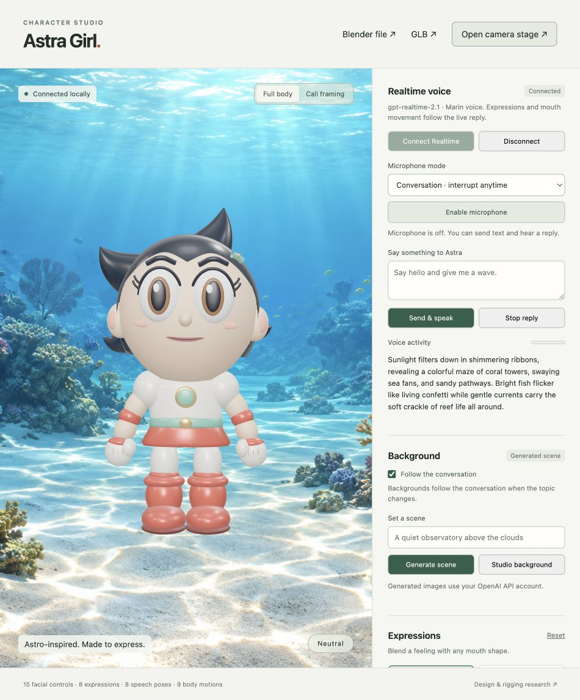

# Astra Girl

An authored Astro Boy / Uran inspired girl character, built in Blender for a live talking-avatar renderer. Black pointed hair, large eyes, ivory robot outfit, mint details, and red boots. No downloaded character geometry was used.

## Open it

Run `git lfs pull` after cloning to retrieve the Blender, GLB, and sample-audio assets.

- **Editable Blender asset:** `assets/astra-girl.blend` (created in Blender 5.2.1 LTS).
- **Portable realtime asset:** `assets/astra-girl.glb`, with skin bindings, facial morph targets, and all nine motion clips.
- **Live controls:** run `npm ci` once, then `npm start`; open <http://127.0.0.1:8847/>. On macOS, double-click `start.command`.
- **Clean camera stage:** <http://127.0.0.1:8847/stage>. It follows the same expression, speech, and motion state as the controls window. Add `?background=transparent` for transparency.
- **Reference research:** [research.md](research.md).

## What is included

15 facial controls, 8 expression presets, 8 coarse speech poses, and a 15-bone articulated skeleton. Expressions, mouth shapes, gaze, and skeletal motion are controlled separately. The simple robot rig uses rigid parts and mitten hands; individual finger articulation, eye tracking, IK solvers, and automatic phoneme recognition are not included.

Expressions: `neutral`, `happy`, `sad`, `angry`, `surprised`, `thinking`, `wink`, `sleepy`.

Speech poses: `rest`, `aa`, `ee`, `ih`, `oh`, `ou`, `mbp`, `fv`. These are an intentionally small stylized vocabulary, not an ARKit-52 or provider-specific viseme rig.

| Motion ID | Blender/GLB clip | Duration | Default |
|---|---|---|---|
| `idle` | Idle | 4 s | Loop |
| `talk` | Talking | 4 s | Loop |
| `wave` | Wave | 3 s | Once |
| `nod` | Nod | 1.8 s | Once |
| `shake_head` | ShakeHead | 2 s | Once |
| `shrug` | Shrug | 2.6 s | Once |
| `think` | Thinking | 3.2 s | Once |
| `cheer` | Cheer | 3 s | Once |
| `listen` | Listening | 4 s | Loop |

The renderer returns to idle after a one-shot gesture. Audio/viseme speech adds gentle conversational movements while idle movement is enabled. Explicit gestures take priority over that automatic body movement. Expression and mouth controls continue throughout.

## Blender controls

Open the `.blend`, select `FACE_CONTROLS` in the Outliner, then Object Properties → Custom Properties. Each value ranges from 0 to 1. Facial meshes have editable relative shape keys; drivers read the control object's values.

Select `Astra_Rig`, switch the Dope Sheet to Action Editor, and select one of the named clips. All nine actions are retained as assets and have editable bone keyframes. Use Pose Mode for your own head, torso, arm, hand, or leg poses.

The file includes a text block named `control_character.py`. Run that text in Blender's Text Editor, or use the Python Console:

```python
exec(bpy.data.texts['control_character.py'].as_string())
set_expression('happy')
set_viseme('aa', 0.7)
play_motion('wave')  # assigns the action and its timeline range
# Press Space in the viewport to play.
set_mouth(0.5)
set_controls({'browInnerUp': 0.8})
```

Keep `character.json` beside the `.blend`; the helper reads its named presets. Head/body actions do not keyframe the face, so they can combine with live facial controls. Blender drivers do not execute in GLB; the supplied web renderer maps the exported morph names directly.

## Local control API

The server binds to `127.0.0.1:8847`. State changes broadcast to every open studio/stage through server-sent events. State is in memory and resets when the server restarts. The service accepts local same-origin browser requests and local backend/CLI requests.

```sh
# Smile, open the mouth, and wave in one update.
curl http://127.0.0.1:8847/api/state \
  -H 'Content-Type: application/json' \
  -d '{"expression":"happy","mouth":{"mode":"manual","open":0.6},"motion":{"name":"wave"}}'

# Speech pose without replacing the facial expression.
curl http://127.0.0.1:8847/api/state \
  -H 'Content-Type: application/json' \
  -d '{"mouth":{"mode":"viseme","viseme":"ou","weight":0.8}}'

# Repeat a gesture at half speed. Send idle to stop it.
curl http://127.0.0.1:8847/api/state \
  -H 'Content-Type: application/json' \
  -d '{"motion":{"name":"nod","loop":true,"speed":0.5}}'
```

`GET /api/state` reads state; `POST /api/reset` restores neutral; `GET /health` checks the service. `POST /state` with `{"level":0.6}` supports the earlier canvas avatar's level contract. Point a compatible audio sender at port 8847 to drive this character.

| Field | Values |
|---|---|
| `expression`, `intensity` | Preset name and strength 0–1 |
| `mouth.mode` | `expression`, `manual`, `audio`, `viseme` |
| `mouth.open` / `mouth.level` | Manual opening / audio level, 0–1 |
| `mouth.viseme`, `mouth.weight` | Speech-pose name and weight 0–1 |
| `look` | `{yaw, pitch, roll}` in radians, clamped to ±0.6 |
| `blink` | `auto`, `open`, `closed` |
| `idle` | Boolean; enables gentle idle and automatic talking gestures |
| `motion` | `{name, speed?, loop?}`; speed 0.25–2 |
| `controls` | Explicit facial overrides, keys listed in `assets/character.json` |

Unspecified fields retain their values. `controls` replaces the override object; `{}` clears it. Explicit `mouthClose` suppresses jaw opening, and blinking suppresses eye widening. Sending a motion again retriggers it. Server-owned `sequence` and `startedAt` fields synchronize newly opened stages; do not send them in updates. A completed one-shot remains in requested state, while the rendered pose returns to idle.

Inside the supplied renderer, `window.avatar` offers `setExpression(name)`, `setMouthOpen(value)`, `setViseme(name, weight)`, `setAudioLevel(value)`, `setLook({...})`, `playMotion(name, {speed, loop})`, `setState({...})`, `reset()`, and `captureStream(30)`.

## OpenAI Realtime voice

The studio now includes a live OpenAI Realtime connection using **gpt-realtime-2.1** and the **Marin** voice.

1. Click **Connect Realtime**.
2. Type a message and click **Send & speak**, or click **Enable microphone** to talk. Use **Conversation · interrupt anytime** to talk naturally over a reply. Choose **Automatic · noise protected** to pause microphone transmission during replies, or **Hold to talk · noisy rooms** to transmit only while holding the button.
3. Astra's returned voice drives her mouth. The model can also choose an expression and a gesture through the constrained `set_avatar` tool.
4. **Stop reply** interrupts generated playback. **Disconnect** closes the WebRTC session, releases microphone tracks, and returns the mouth to rest.

Microphone capture starts only when you click Enable microphone and grant browser permission. Conversation mode keeps the microphone open and lets detected speech interrupt Astra. Noise-protected mode pauses microphone transmission while Astra is preparing or playing a reply, then resumes after a short echo guard; use Stop reply to interrupt her in that mode. Hold-to-talk mode disables automatic turn detection and submits your turn immediately on release. Browser echo cancellation and noise suppression remain on; automatic gain is off to avoid amplifying room noise. Each studio tab owns its own session; use one connected studio tab plus as many clean camera-stage tabs as needed. The stage follows the shared avatar state; audio plays in the connected studio tab.

The standard API key stays on the server. Set `OPENAI_API_KEY` in the server environment, or place the key in `~/.config/astra-girl/openai-api-key` with permissions `600`. Credentials are excluded from this repository and release packages, and are never included in browser assets. Set `OPENAI_REALTIME_MODEL` to override the default model.

`GET /api/realtime/status` returns only whether a key is configured, the model, and the voice. `POST /api/realtime/session` accepts a WebRTC SDP offer and proxies initialization to OpenAI's `/v1/realtime/calls` endpoint. The browser receives the SDP answer; subsequent audio and data events use WebRTC. This follows [OpenAI's unified WebRTC interface](https://developers.openai.com/api/docs/guides/realtime-webrtc). Conversation items, spoken transcript events, and tool responses follow the [Realtime conversations guide](https://developers.openai.com/api/docs/guides/realtime-conversations).

The remote audio is attached to a playback element and separately analyzed at 25 Hz. Its level reaches the local mouth directly; shared stage updates follow through the server without overriding fresher local audio. Gesture changes crossfade, and short speech pauses preserve conversational motion. Only returned model audio drives the mouth. Expressions and body gestures can change through model tool calls while speech continues. This is audio-reactive synchronization, not phoneme-level viseme generation.

Live validation on this Mac: authenticated API access; WebRTC connection; generated speech from typed prompts; model-issued happy/wave and surprised/nod controls; nonzero voice-driven mouth levels up to 0.681 in the counting test; visible mouth movement during a second reply; Stop reply returning the mouth to zero; disconnect/reconnect. The initial output-synchronization checks used typed prompts. The microphone was later restored for user testing; sustained microphone turn-taking and FaceTime routing remain acceptance gaps. Twenty-seven automated tests pass, including server-side credential handling, invalid SDP, and sanitized upstream errors.

## Reload after an update

An already-open tab keeps its older JavaScript until reloaded. If speech is transcribed but no answer follows, or the page reports an active-response conflict, disconnect, reload the studio, and reconnect. The current controls show Conversation, Noise protected, and Hold to talk modes. A stale client displaying this conflict was recovered this way during testing.

## Noise and response-delay fixes

The default session uses minimal reasoning effort, far-field input noise reduction, a 0.72 voice-activity threshold, a 350 ms end-of-turn silence interval, and automatic interruption in Conversation mode. The separate Noise-protected mode disables automatic interruption. Ordinary greetings no longer require an avatar tool round trip; explicit gesture requests still use the tool. These controls follow the [OpenAI voice activity detection guide](https://developers.openai.com/api/docs/guides/realtime-vad) and [Realtime session schema](https://developers.openai.com/api/reference/resources/realtime/subresources/client_secrets/methods/create).

A synthetic quiet-speech replay reproduced cancellation 233 ms into the old reply. The protected configuration prevented cancellation. A controlled comparison reduced first-audio delay from 6.626 seconds to 0.650 seconds; the protected-mode replay measured 1.100 seconds. These are individual API replay measurements, not a guarantee for every network or room. Native room-noise rejection and a physical hold-to-talk conversation still need your microphone test. Use Hold to talk when other people or a television are audible; automatic noise reduction cannot reliably identify which speaker is addressing Astra.

## Dynamic generated backgrounds

**Follow the conversation** is on by default. The completed reply text and latest user turn go to a separate GPT-6 Astra request. GPT-6 decides whether the topic needs a different setting and uses GPT Image 2.5 Flare to generate it. Voice playback continues independently. Repeated topics, greetings, and filler can keep the existing image. These are generated environment illustrations, not live views of the user's surroundings.

Use **Set a scene → Generate scene** for a direct request, such as an observatory above the clouds. Turn off **Follow the conversation** to freeze the scenery; direct requests still work. **Studio background** restores the original gradient. Images use the configured OpenAI API account. The first direct API image test took 23.5 seconds; generation is asynchronous and not instantaneous.

The backdrop is drawn into the same WebGL canvas as Astra, with aspect-preserving cropping and a 1.2-second crossfade. Reduced-motion mode switches without the fade. The studio, clean `/stage`, and the renderer's canvas stream share the scenery. `/stage?background=transparent` intentionally omits it.

Only one scene job runs at a time. New context replaces the queued context, stale results cannot overwrite a newer scene, a brief follow-up can retain the image already being generated, and an error leaves the previous image visible. Generated files live in `.generated-backgrounds/`, which is excluded from Git and release packages. The current selection is held in memory and resets on server restart. Conversation context is not written to application logs; the GPT-6 Responses request uses `store: false`.

| Endpoint | Purpose |
|---|---|
| `GET /api/background` | Read scene state and model IDs |
| `GET /api/background/events` | Subscribe to shared scene updates |
| `POST /api/background/context` | Submit `{context, force?: boolean}`; returns immediately |
| `POST /api/background` | Set `{enabled: false}` or `{reset: true}` |

The standard API credential stays on the local server. This follows the [OpenAI image generation guide](https://developers.openai.com/api/docs/guides/image-generation): GPT-6 Astra at the Responses API's top level with GPT Image 2.5 Flare in the `image_generation` tool. No separate image-generation service or API key is required.

Live validation: a typed coral-reef conversation produced speech and then an actual generated reef backdrop; the studio and clean camera stage both displayed it. The source image and character remain separate layers. Queue, stale-result, cancellation, no-change, error-preservation, and HTTP validation paths have automated coverage. A sustained microphone conversation with several scene changes remains user acceptance.



## Other voice providers and timed visemes

The studio's audio picker already analyzes a local file and drives the mouth. `previews/voice-demo.wav` is a 19-second macOS synthesized sample used for playback testing. The silent talking demo cycles poses without generating sound.

For outgoing TTS audio in this renderer's origin:

```js
import {connectAudioElement, scheduleVisemes} from '/viewer/voice-adapter.js';
const audio = new Audio('/your-voice-audio.wav');
const adapter = await connectAudioElement(audio, {
  onLevel: level => window.avatar.setAudioLevel(level)
});
await audio.play(); // invoke from a user gesture to satisfy browser audio policy
// Later: audio.pause(); await adapter.dispose();
```

The amplitude adapter is audio-reactive mouth opening. It cannot identify phonemes. If your provider supplies timed visemes, map its IDs to this rig's speech-pose names and use `scheduleVisemes(audio, events, callback)` instead of amplitude control:

```js
const stop = scheduleVisemes(audio, [
  {timeMs: 0, viseme: 'rest'},
  {timeMs: 160, viseme: 'mbp'},
  {timeMs: 240, viseme: 'aa', weight: 0.8},
  {timeMs: 420, viseme: 'ee'},
  {timeMs: 600, viseme: 'rest'}
], (name, weight) => window.avatar.setViseme(name, weight));
```

Event times refer to actual audio playback. `connectAudioStream(stream, {onLevel, monitor:false})` accepts an existing outgoing WebRTC/voice `MediaStream`. It requests no microphone permission and does not stop the caller-owned stream. Dispose the adapter when done. Keep provider secrets in your backend; the offline controls and audio-file demo need no provider key.

## OBS and FaceTime

1. Start this server. In OBS, add a Browser Source using `http://127.0.0.1:8847/stage` at 1280×720. Disable “Shutdown source when not visible” if you want it to keep animating.
2. Start OBS Virtual Camera. If macOS requests it, enable the OBS camera extension.
3. In FaceTime's Video menu, select OBS Virtual Camera.
4. Route the outgoing voice audio separately to FaceTime's selected microphone device. Choosing a virtual camera does not route audio.

Apple's device menu and OBS's modern camera compatibility are documented in [research.md](research.md). This delivery verifies the local 3D renderer and audio playback. OBS capture, FaceTime camera selection, audio routing, and a real call have not been tested for this character.

## Rebuild and validation

```sh
/Applications/Blender.app/Contents/MacOS/Blender -b -t 6 --python src/build_character.py
npm test
```

The build recreates the asset from authored geometry; it overwrites generated assets/previews. Append `-- no-render` to skip preview renders. Save artistic edits under another name before rebuilding.

Validated: native Blender renders; saved-file rig/helper execution; GLB skinning, all 15 nonempty morph controls and all nine skeletal clips; expression/speech layering; HTTP validation and compatibility; live browser wave and cheer; local speech audio driving the mouth and returning to zero when finished; clean stage loading shared state. Twenty-seven automated tests pass. OpenAI Realtime was connected and live output synchronization was verified as described above. The timed speech-pose scheduler remains available for providers that supply viseme events.
