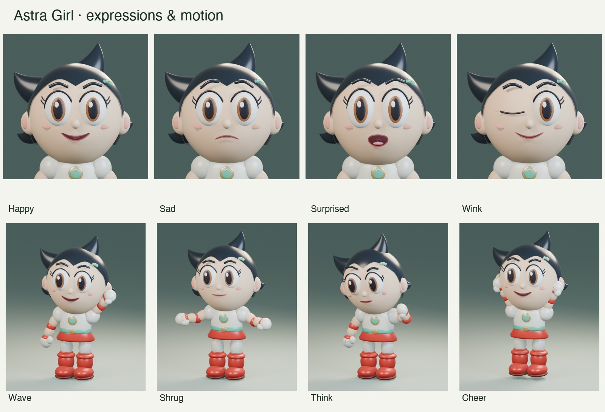

# Astra Girl progress — September 10, 2026

## Result

Built an Astro Boy / Uran inspired girl avatar from authored Blender geometry, then connected it to live OpenAI Realtime voice. The [project](../astro-girl-avatar/README.md) contains the editable Blender file, portable GLB, generation source, renderer, local control API, voice integration, tests, reference research, and preview renders. It is a self-contained browser/Blender experiment alongside the existing spatial projects; it does not change the Quest or phone runtime.



## Development and corrections

1. **Character and rig.** Created the pointed black hair, expressive face, robot outfit, gloves, and red boots. Authored 15 facial controls, eight expression presets, eight coarse speech poses, and a 15-bone rig. All geometry was authored locally; reference research is linked in the project. Added actual closed-eyelid geometry after the initial blink collapsed incorrectly, and repaired a mouth-cavity fold visible in combined expression/speech poses.
2. **Editable motions.** Added nine Blender actions and GLB clips: idle, talking, wave, nod, shake head, shrug, think, cheer, and listen. Facial expression, speech, head orientation, and body motion combine independently. One-shot gestures return to idle. The browser crossfades clips and accepts repeated gesture requests.
3. **Local studio and API.** Built Three.js controls and a clean camera stage. HTTP state updates broadcast to all views, with validation and a legacy audio-level endpoint. Local audio files and supplied voice streams can drive the mouth; timed viseme events are supported when a provider supplies them.
4. **Realtime speech.** Added server-side WebRTC initialization for `gpt-realtime-2.1`, Marin playback, outgoing-audio analysis, and constrained expression/gesture tool calls. Remote audio needed a playback element as well as an analyser for WebKit to decode it reliably. Standard API credentials stay outside the repository and browser assets.
5. **Slow, interrupted, glitchy replies.** User testing reported background sound cancelling replies and choppy motion. A synthetic quiet-speech replay reproduced cancellation 0.233 seconds after response creation. Disabled automatic interruption, added microphone gating during replies and an echo cooldown, enabled far-field noise reduction, and added hold-to-talk mode. Minimal reasoning and fewer unnecessary tool round trips reduced measured first-audio delay. Direct local audio levels now take priority over delayed shared-state echoes; speech holds and gesture crossfades reduce motion flicker.
6. **Hearing speech without replying.** Inspected the user's active tab after another report. It showed an active-response conflict and was still running the earlier client, visibly missing the microphone-mode selector. Disconnected and reloaded that tab, reconnected, verified a new spoken-reply transcript, and restored its microphone. This establishes stale-client recovery; it does not establish all microphone turn-taking conditions. Reload open studios after a code update before reconnecting.

7. **Restore natural interruption.** The user correctly pointed out that microphone gating also prevented intentional interruption. Conversation mode now keeps the mic open and enables server interruption. The previous behavior remains an explicit Noise-protected option, alongside Hold to talk. A new regression test reproduced the disabled-microphone symptom before this change; all 19 tests pass afterward. Physical barge-in comfort remains user acceptance.

## Verification

- Native Blender renders and saved-file helper/rig execution succeeded.
- The exported GLB contains real nonempty morph targets, skin bindings, and all nine skeletal clips.
- Live browser checks covered facial/speech layering, wave/cheer motion, shared camera-stage state, and local synthesized audio returning the mouth to zero at playback end.
- Live Realtime checks covered authentication, WebRTC, typed prompts producing speech, model-issued expressions/gestures, nonzero audio-driven mouth levels, Stop reply, and disconnect/reconnect.
- The synthetic replay with interruption protection prevented the baseline cancellation. Individual first-audio measurements were 6.626 seconds before minimal reasoning, 0.650 seconds after it, and 1.100 seconds in the final configuration replay. These are individual API observations, not a room or network latency guarantee. Sanitized event-type/timing records and the optional paid-API replay are in [debug](../astro-girl-avatar/debug/README.md). The final replay ended with an incomplete response after audio began; its assertion concerns first audio and cancellation, not a complete 150-word answer.
- `npm ci && npm test` passed **28/28 tests in the repository copy**, including morph/clip integrity, expression/speech precedence, stale shared-audio protection, microphone gating, input policy, HTTP validation, and credential-error redaction. These automated tests do not exercise a physical microphone or FaceTime.

## Dynamic backgrounds added after the voice work

The user requested GPT-6 image generation to change the setting based on the conversation. Added a separate server-side Responses request with GPT-6 Astra directing GPT Image 2.5 Flare. The completed assistant reply and latest user turn provide context; GPT-6 can retain the current setting or generate a new environment. This does not add a blocking tool round trip to Realtime speech.

Scene requests queue asynchronously, coalesce to the latest pending context, and preserve the existing image during generation or errors. A brief follow-up can retain a scene already being generated. Users can pause automatic changes, request a scene directly, or restore the studio gradient. Backdrops crossfade inside the same WebGL canvas and appear in the clean camera stage; the transparent-stage option omits them.

A direct observatory image request succeeded in 23.508 seconds. A real typed coral-reef conversation then produced speech and a generated underwater backdrop, visibly verified in both studio and camera stage. A subsequent request to keep the reef left its URL and scene revision unchanged. The [live screenshot](../astro-girl-avatar/previews/live-reef-studio.png) records that local result. Generated cache files and conversation context are excluded from the repository; the Responses call sets `store: false`. All 28 automated tests pass, including queue ordering, stale-result suppression, retaining an in-progress scene after a brief follow-up, disabling/resetting, error preservation, and HTTP validation.

A final three-tab test exposed HTTP connection exhaustion: separate character/background SSE streams occupied all six browser connection slots, delaying model assets, scene POSTs, and WebRTC initialization. Closing one test tab immediately released the stall. Both state types now share one SSE connection per page; the three-window loading flow was replayed successfully. Duplicate scene clicks no longer queue identical image jobs, and late audio-play errors from a disconnected session no longer overwrite the active session.

## Remaining acceptance

A sustained physical-microphone conversation, real-room noise behavior, and physical hold-to-talk use still need testing. Mouth synchronization follows audio amplitude; phoneme-accurate lip sync requires provider visemes. The mitten rig has no individual fingers or IK. OBS capture, FaceTime virtual camera selection, audio routing, and an actual call remain unverified.

## Run or continue

```sh
git lfs pull
cd astro-girl-avatar
npm ci
npm test
npm start
```

Open `http://127.0.0.1:8847/`. Configure a server-side OpenAI key as described in the project README, reload any older studio tabs, then connect. Use the clean `/stage` view for camera capture. Blender/GLB/audio binaries use Git LFS. No credentials, private microphone recordings, dependencies, or build caches are imported.

## Latest behavior: three-turn automatic scenery

Automatic scene generation now occurs every three completed conversation exchanges, using those three turns as context. GPT-6 chooses the best setting and generates a new image even when the overall topic is unchanged. An explicit background request starts generation immediately and resets the counter. Completed audio playback gates ordinary turn counting; interrupted replies and duplicate events are excluded. The current test suite passes 34 tests. The studio displays the number of turns until its next automatic scene.


Live cadence verification passed: the first two typed exchanges left the studio background unchanged; the third generated a reef. An explicit forest request immediately reset the counter, but visual inspection caught the previous scene influencing the generated image. Explicit generation now excludes the previous setting entirely, and scheduled input leads with the current conversation. A repeated live request produced the requested pine forest at sunrise, visibly verified in the studio, with the counter still at zero after its spoken acknowledgement. The microphone was restored in interrupt-anytime mode. All 35 automated tests pass.
