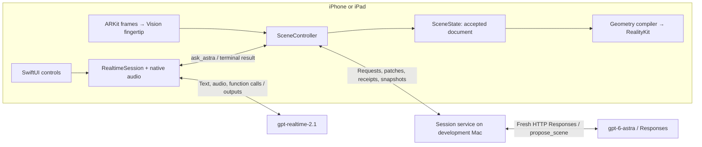

# Architecture

This document describes the AR application in `app/AR/`. The independently running Quest application and its bridge are preserved in `app/VR/`; see [the integration record](ar-vr-integration.md).

Astra Spatial is a universal iPhone/iPad app for exploring editable 3D structures through conversation and pointing. The rack is example content. The reusable code is a scene reducer, procedural geometry compiler, native renderer, and input adapters.

## Code boundaries

| Directory | Responsibility | Does not own |
| --- | --- | --- |
| `app/AR/SpatialDemo/UI` | Product controls, status, local diagnostic viewer | Network and scene execution |
| `app/AR/SpatialDemo/Conversation` | Realtime text/audio turns, function-call lifecycle, native audio I/O | Scene operations or rack-specific behavior |
| `framework/Sources/SpatialCore` | Scene values, validation, immutable request hashes, pure transactional reducer | Apple graphics, network connections, server hardware knowledge |
| `framework/Sources/SpatialApple/Rendering` | Mesh/material compilation, entity hierarchy, AR/preview surfaces | Semantic scene authority |
| `framework/Sources/SpatialApple/Input` | Touch selection and camera-fingertip mapping, dwell and speech locks | Model inference or geometry edits |
| `framework/Sources/SpatialApple/Transport` | Native scene WebSocket and session envelopes | Model prompting |
| `framework/Sources/SpatialApple/Storage` | Manual SQLite document checkpoints | Autosave policy or GPU resources |
| `framework/Sources/SpatialApple/Diagnostics` | Bounded local event recorder and export | Conversation content or credentials |
| `backend` | OpenAI credentials, Astra authoring, proposal normalization, acknowledged scene mirror | Native entity state or rendering |
| `assets/server-rack` | Authored starting assembly, component descriptions and references | Special rack commands or a separate executor |
| `tools/Sources/SceneLab` | Seed generation and headless live-model acceptance using the production reducer | Rendering or camera testing |
| `tools/Sources/PointingReplay` | Synthetic input replay using the production pointing resolver | A second product app, Vision inference, or a renderer |

`SpatialApple/SceneController.swift` connects the native collaborators and serializes scene installation. It is the device-side coordinator, not another framework layer. The Swift package has only two library targets: `SpatialCore` and `SpatialApple`.

## Product app versus test tools

There is no separate iOS harness implementation. `app/AR` is the real application. On hardware it uses the AR camera; in Simulator it uses RealityKit's non-AR surface. The reducer, compiler, networking, and controls are shared. Simulator cannot prove camera tracking or physical pointing.

The former Mac harness is a command-line pointing replay in `tools/Sources/PointingReplay`. It supplies synthetic landmarks and a two-region hit-test stub to the same mapper/resolver that the app uses, then checks the results. It needs no camera or second scene implementation. `tools/Sources/SceneLab` separately proves the real backend-to-Swift contract without a renderer. [Testing and evidence boundaries](testing-harness.md).

## Current runtime flow

Typed text and local speech onset enter one Realtime conversation. Realtime is forced to call `ask_astra` exactly once with `{request: string}`; the app binds authoritative selected IDs locally, executes the call only after `response.done`, awaits the terminal scene-service result for the matching request ID and epoch, then sends `function_call_output` and requests the final response. Realtime does not independently mutate the scene. The backend provides an ephemeral Realtime credential; the OpenAI API key stays in its process.

A request runs as follows:

1. **Choose the subject locally.** Touch selects a semantic node. On physical devices, foreground hand sampling maps a Vision fingertip through its ARFrame display transform, hit-tests RealityKit, and requires stable hover; the simulator uses touch. Speech onset captures that target; later pointer movement cannot retarget the request.
2. **Interpret and execute the turn.** Text enters a Realtime user item; speech enters its audio buffer. After the audio item is committed, the app requests a tool response. Only a matching, completed response with exactly one valid `ask_astra` call can execute. Its arguments contain request text; selected IDs come from the local input snapshot. `SceneController.execute` then advances the intent epoch, sends the fence/current snapshot, and submits that request to the scene service.
3. **Author a bounded proposal.** Astra returns one structured `propose_scene` call: either an explanation, a new assembly, or edits. The backend resolves aliases and assigns IDs/hashes. Invalid proposals get one bounded repair before device delivery.
4. **Validate and install.** The device applies the proposal to a copy of the pure reducer, prepares native resources, rechecks the current scene/epoch/revision, and installs the accepted semantic state and native entities in one serialized step. Invalid work leaves the scene intact.
5. **Acknowledge and explain.** The device sends receipts and a snapshot. After the terminal scene-service result, the app returns `function_call_output` and asks Realtime for the final response, delivering text for typed turns or audio plus transcript for spoken turns with state/epoch gating.

Stop, Undo, scene replacement, disconnection, and superseding turns invalidate pending work. Realtime responses carry local turn metadata; scene work carries request IDs, intent epochs, and revisions. Each stage has a deadline and reports failure instead of leaving the UI busy indefinitely. The HTTP Responses adapter uses streaming transport but accepts authoring only after completed function output and a successful response completion. Progressive installation, Responses steering, PTC, and a WebRTC sideband are not implemented.

## Generation, rendering, and persistence

**Astra generates structured geometry descriptions. Swift constructs meshes. RealityKit renders frames on the device GPU.** Cloud model inference does not mean cloud rendering.

The implemented vocabulary is box, sphere, cylinder, cone, tube, and arrow recipes plus approved `importedAsset(assetID, partID)` references. Imported assets use host-owned descriptors and preserve their native PBR materials; the accepted Akeil rack asset exposes the frame and 18 server wrappers. Generic approved detail templates can expand one eligible instance into immediate child nodes while preserving its ID and pose; other instances remain unchanged. Parent/child relationships preserve assemblies. Moving an assembled server changes its parent transform; moving a fan changes that component's transform. Neither operation requires regenerating the mesh. Undo restores the latest accepted transaction. The imported Akeil source is an exterior rack asset; unavailable source interiors remain unavailable.

The normalized scene is versioned UTF-8 JSON with metres, +Y-up coordinates, quaternion rotations, stable node IDs, semantics, and source provenance. Wire JSON and typed canonical hash bytes are intentionally different representations. The provider tool schema is an adapter, not the public scene contract. [Exact formats](../framework/contract/README.md) · [Representation rationale](data-formats.md).

The app preserves authored physical size: the rack is 2.21 metres tall at root scale 1. It does not normalize imported assemblies or their children to a miniature display size. The non-AR preview fits its camera to the first visible scene bounds and viewport aspect; resizing refits the same bounds, while later patches keep the camera steady. Physical AR uses ARKit's camera and plane placement. Generated geometry honors requested/source dimensions and ancestor transforms; standalone illustrative objects without dimensions use an inspectable default size.

The active device's `SceneState` is authoritative. RealityKit entities are a derived projection; the service's acknowledged mirror is model context. SQLite saves normalized documents through manual checkpoint APIs. App Save/Open controls, autosave, and restoration of real-world anchors are future work; imported asset loading is implemented through the host descriptor catalog. [Storage](storage.md).

The default content is the source-derived exterior and internal assembly packages in `assets/imported-rack`. `DemoAssetLibrary` supplies approved resources and hierarchy bindings from that data. The earlier procedural seed remains bundled directly from `assets/server-rack/scene.json`; neither content package has a phrase-to-animation route. A live fan-generation acceptance run uses the same contract without rack-specific code, although a public third-party SDK is not yet packaged.

## Why this stays editable

- A semantic component has its own stable node identity, parent, transform, role, and provenance. It is not inferred from a flattened rendered mesh.
- The reducer enforces references, hierarchy, finite values, budgets, strict revision/epoch checks, generation ownership, and immutable retries.
- Geometry resources are cached and shared; a transform edit preserves native entity identity.
- Selection and spoken-request locks are local UI/input state. They do not create scene revisions.
- A successful installation receipt means native entities were installed. A screenshot or measured frame is separate evidence that they became visible.

A later Blender worker can generate additional immutable hierarchical USDZ assets plus component mappings. The current loader verifies approved assets, preserves named parts, and lazily prepares an interior package when Astra requests its advertised children. Offline Blender compilation produces those packages; a live Blender bridge and automatic visual LOD are future work. [Asset pipeline](asset-pipeline.md) and [generic detail expansion](generic-asset-detail-expansion.md).

## Read the code in order

1. [App entry](../app/AR/SpatialDemo/SpatialDemoApp.swift) and [app session](../app/AR/SpatialDemo/DemoSessionModel.swift).
2. [Scene coordinator](../framework/Sources/SpatialApple/SceneController.swift).
3. [Pure reducer](../framework/Sources/SpatialCore/SceneState.swift) and [closed decoder](../framework/Sources/SpatialCore/SceneWireDecoder.swift).
4. [Native projection](../framework/Sources/SpatialApple/Rendering/SceneRenderer.swift) and [mesh compiler](../framework/Sources/SpatialApple/Rendering/GeometryCompiler.swift).
5. [Backend session](../backend/src/session.ts), [Astra adapter](../backend/src/astra/client.ts), and [normalizer](../backend/src/normalizer.ts).
6. [Pointing resolver](../framework/Sources/SpatialApple/Input/PointingResolver.swift) and [voice integration](../app/AR/SpatialDemo/Conversation/README.md).

[Evidence](evidence/README.md) separates synthetic tests, live provider acceptance, native simulator rendering, and physical-device observations. [APPROACH.md](../APPROACH.md) records how Arav and Astra built and tested the project together. [Apple references](apple-references.md) and [hand-tracking source study](hand-tracking-references.md) connect implementation choices to primary documentation.
