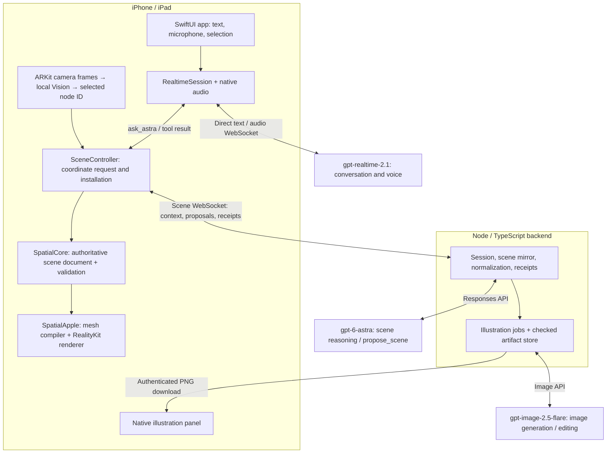

# Astra Spatial — hackathon technical brief

**A native iPhone and iPad app that turns conversation into an editable, interactive 3D explanation.**

The learning goal is to make structure easier to understand: a person can look inside an assembly, keep the surrounding context, and ask the next question at the relevant part.

Prepared September 8, 2026 from the current source on branch `Arav`: commit `8d93cb3` plus the native-flow changes in the working tree. Implementation claims were checked against code; demonstration results below come from the repository’s recorded evidence, not a new device trial.

## A 60-second explanation

> Astra Spatial lets you explore how something works by talking about it and pointing at its parts. Our first example is a server rack: you can place it in AR, select a server, pull it out, reveal its internal components, and ask for an explanation of how they work together.
>
> The AI works with a structured scene of named, individually editable parts. It can move existing components, create new geometry, add animated paths showing relationships, or request a generated teaching diagram. Follow-up questions use the current scene and selected component as context.
>
> The key engineering decision is that Astra proposes changes and the device validates and installs them. Swift builds the geometry, RealityKit renders it locally, and the assistant waits for installation confirmation before reporting a scene edit as complete. That connects the conversation to what the application actually did.
>
> The server rack is our first example; the same scene framework also handles unrelated objects such as lamps and generated fans.

## What the user can do

| Feature | Behavior and significance |
| --- | --- |
| **Explore a native AR assembly** | Load the bundled rack and tap a detected surface to place it. ARKit supplies camera tracking and placement; RealityKit renders the virtual assembly. The app preserves authored physical dimensions, including the rack’s 2.21 m height. Simulator uses a non-AR preview with a fitted camera. |
| **Type or speak in one conversation** | The composer accepts text and explicit microphone input. Its action becomes Send when text is present. Typed turns receive final text; spoken turns use audio plus a transcript. Launching the app does not start the microphone. |
| **Select a subject by touch or hand pointing** | Tapping selects a semantic component. On hardware, Apple Vision tracks the visible index fingertip and drives a cursor over the camera view. Stable hover resolves to a component, with visual selection feedback. This is screen-aligned pointing; the app does not reconstruct a physical finger ray through the room. |
| **Ask about “this” component** | The app binds the selected component’s identity to the request. Speech onset locks the target so later hand movement cannot redirect an already-started request to another part. Ambiguous or stale pointing is handled locally. |
| **Manipulate assemblies through language** | Requests can translate, rotate, scale, recolor, hide, reveal or remove scene nodes within the supported contract. Parent/child structure keeps an assembly together when its parent moves. Follow-ups can operate on an individual child. These are scene edits, not a library of canned rack animations. |
| **Reveal detail only where needed** | Astra can request an approved interior package for one selected server. The server retains its identity and current pose while gaining nine internal teaching groups, including cooling, processors, memory, storage and power. The other server instances remain intact. |
| **Generate new editable structures** | Astra can compose boxes, spheres, cylinders, cones, tubes and arrows into named assemblies. A recorded live example created a fan with a hub and three separately editable blades. Geometry descriptions become native meshes on the device. |
| **Show animated relationships in 3D** | The new flow recipe connects named components with smooth paths, arrowheads, labels and moving markers. Endpoints remain bound as components or ancestors move. Follow-ups can reverse, hide or delete a flow while preserving its identity. Flows illustrate relationships; they do not run a heat, fluid or electrical simulation. |
| **Generate and refine teaching illustrations** | Astra can request a 2D diagram or cutaway in a separate native explanation panel. It can refine a previous image, using the actual generated PNG as the edit reference. The editable 3D scene stays available while the image job runs. The panel supports expansion, Stop and Retry. |
| **Continue with meaningful context** | The model receives the accepted scene, selected IDs, hierarchy, component semantics, available detail packages and bounded conversation history. Native structural bounds can help place flow attachments. Follow-ups operate on the current accepted state. |
| **Distinguish source content from illustration** | Imported resources carry source metadata and approved part identities. Procedural geometry and generated images can be identified as illustrative. This matters when explaining hardware: an educational diagram is not a verified CAD reconstruction or measurement. |
| **Recover from connection and job failures** | The app restores its saved endpoint settings, preserves rejected/unsent text, shows connection-specific errors, and supplies image retry controls. Settings includes diagnostics export. Finite deadlines and request identity checks keep abandoned work from silently becoming current. |

The framework also implements transactional **Undo**, cancellation and manual **SQLite scene checkpoints**. General Undo/Stop buttons and Save/Open controls are not exposed by the current product screen; these should be described as engine capabilities, not demonstrated as existing buttons. The microphone’s Pause control and the illustration panel’s Stop control have narrower roles.

## Overall architecture

There are three main responsibilities: the **app handles interaction**, the **native framework owns accepted scene state and rendering**, and the **backend handles model calls and credentials**.

The backend also issues the short-lived credential used by the app’s direct Realtime connection. The long-lived OpenAI API key stays in the backend.

| Layer | Technology | Owns |
| --- | --- | --- |
| Product app | Swift 6, SwiftUI, native audio APIs | Phone/tablet layout, composer, conversation lifecycle, microphone/playback, illustration panel and settings. |
| Portable scene core | Foundation-only Swift package, versioned JSON contract | Scene values, strict decoding, semantic validation, revision handling, hashes, transactions and Undo. |
| Apple runtime | RealityKit, ARKit, Vision, SQLite | Mesh creation, imported resources, entity hierarchy, AR placement, picking, flow animation, image loading and checkpoint APIs. |
| Session backend | Node.js 22+, TypeScript, `ws` | Authenticated connections, model context, Astra calls, proposal normalization, acknowledged scene mirror, image jobs and artifacts. |
| Asset pipeline | Offline Blender/USDZ preparation plus JSON catalogs | Reproducible source-derived resources, component mappings, selection proxies, units, checksums and provenance. |
| Acceptance tools | Swift SceneLab/PointingReplay and focused scripts | Exercise production reducers and input logic, live model contracts, native resource checks and diagnostic evidence. |

The current verified remote route is an authenticated HTTPS/WSS tunnel to a development Mac. Production build/container files exist; the project does not yet have a verified independently hosted production deployment.

## One request, end to end

For example: select a server and ask, **“Pull this out and show me what’s inside.”** A useful request may produce movement or scoped detail expansion according to the model’s proposal.

1. **Capture intent and selection.** The app records the text or speech turn and locally chosen component IDs. Selection does not depend on a later model guess about where the finger moved.
2. **Route the conversation.** Realtime is instructed to make exactly one `ask_astra({request: ...})` call. The app waits for the completed tool response, binds its local scene context, and dispatches the scene request.
3. **Give Astra structured context.** The backend supplies the accepted scene, current revision, selected IDs, relevant history and approved detail availability. It calls `gpt-6-astra` through the Responses API.
4. **Receive one bounded proposal.** Astra returns one `propose_scene` result: an explanation, generation or patch. The backend resolves aliases, assigns stable IDs, creates canonical hashes and converts higher-level actions into scene operations. Invalid output gets one bounded repair attempt before delivery.
5. **Prepare and validate locally.** The device tries the operations on a copy of its scene state and prepares required native resources. It rechecks scene identity, revision and intent after asynchronous preparation, then installs the accepted state and native entities in a serialized commit. Failed preparation or validation leaves the existing scene intact.
6. **Return execution evidence.** The device sends installation receipts and a fresh snapshot. The backend updates its model-context mirror from acknowledged state. A receipt means native installation succeeded; it does not prove the object is inside the camera’s view.
7. **Deliver the final explanation.** The app returns the scene-service result to Realtime and requests the final text or audio response. Scene-edit success is therefore based on execution results. An illustration request instead starts a separately tracked job whose image can arrive after the conversational explanation.

The model adapter consumes streaming HTTP output, but it waits for a complete validated proposal. The current authoring path does not progressively install partial model tokens as 3D objects.

## The technical decisions worth explaining

### 1. The scene is structured, editable data

A scene contains nodes with stable IDs, parent relationships, local transforms, geometry/material references, semantics and provenance. It can also contain semantic relationships separate from physical containment. Coordinates use metres and quaternion rotations.

For example, a rack contains a server; a revealed server contains a cooling group. Moving the server changes its parent transform and carries the children with it. Moving the cooling group changes that child’s transform. The system retains identities across those edits, making subsequent questions refer to the same components.

Geometry definitions are immutable and reusable. Multiple blades or repeated imported parts can share a resource while retaining separate selectable node identities. The model sends compact descriptions and approved asset references; Swift constructs procedural meshes and RealityKit renders on the device GPU.

### 2. The device decides what was accepted

`SceneState` is the authority. RealityKit entities are its visual projection, and the backend holds an acknowledged mirror for model context.

The contract rejects unknown fields, missing references, cyclic hierarchies, invalid numbers and excessive work. Current limits include 2,000 scene nodes, 128 operations per batch and 32 flow instances. Imported resources must match the host-approved catalog.

Revisions detect proposals based on an older document. An **intent epoch** is a counter that invalidates work from an earlier user intention. Canonical SHA-256 request hashes make retries unambiguous: the same request returns its original result; reusing its ID with different content is rejected. These checks prevent delayed or duplicated responses from quietly altering the wrong state.

### 3. Rich assets preserve manipulation boundaries

The default exterior contains a rack frame and 18 independently addressable server wrappers. An approved interior resource can expand one server into nine source-derived groups. Expansion preserves the server’s ID, parent and current pose; it does not replace the whole scene or open every server.

Blender preparation happens offline. The pipeline combines meshes within chosen teaching/manipulation groups, retains source mappings, checks units and transforms, and generates smaller selection proxies. The interior package has 76 proxy boxes for selecting useful parts without one large bounding box swallowing the surrounding empty space. Resource loading is lazy and checksum-verified.

The generic runtime has no fixed rack → server → processor hierarchy. Asset data supplies those meanings. Missing source detail remains a limitation; the system cannot recover exact internals from an exterior mesh.

### 4. Animation runs locally after authoring

A flow stores source and target node IDs, local attachment points, optional route points, direction, width, label and animation intent. The renderer resolves the hierarchy, constructs a smooth path and arrowhead, and caches path samples, labels and marker resources.

Up to four markers per flow move using cached arc lengths. Ordinary animation frames change marker transforms without rebuilding meshes or calling the model. Accepted component movements update the derived path. Reduce Motion leaves the static path and label while disabling the moving markers.

### 5. Images are separate, traceable artifacts

Flare generates a completed 1024 × 1024 PNG from a bounded teaching brief and accepted component semantics. The current path does not supply a camera photo or a rendered assembly screenshot. Refinement supplies the previous generated PNG.

Jobs are tied to scene identity, revision, document hash and component set. Scene changes retire obsolete results; ordinary conversation can continue without cancelling an image. Retrying an image job does not replay a scene mutation. Artifacts carry checksums and provenance, use bounded server/device caches, and are verified on authenticated download. The app receives a completed image rather than streamed previews.

### 6. Local perception and cloud reasoning have distinct roles

Camera frames are processed by ARKit and Vision locally in the current implementation. The selected semantic IDs and scene context inform Astra. When the user enables the microphone, audio is sent to OpenAI Realtime. Text and scene context also leave the device for reasoning, and generated images are downloaded from the backend. The current app is not a continuous camera-video conversation with the cloud model.

## What has actually been demonstrated

| Area | Recorded evidence and boundary |
| --- | --- |
| **Physical iPhone interaction** | Three typed turns completed: pulling out a server, explaining heat flow and adding arrows. Logs show native installations and final responses; the visual interpretation comes from Arav’s report. Those turns took approximately 6.5, 9.0 and 19.0 seconds to final response. |
| **Physical iPad pointing** | Arav observed the fingertip ring tracking and turning green over a part. Quantified accuracy and the combined point-and-speak interaction are still unverified. |
| **Native detail expansion** | Simulator app turns expanded one imported server and then manipulated its children. Native tests checked preserved identity/pose, other-instance isolation and Undo. |
| **Generated illustrations** | Real Astra/Flare generation and refinement passed, with image panels inspected on both simulator layouts. A later rack/refinement pair reached image-ready in 16.1/18.2 seconds; exact appearance and instance placement remain imperfect/unverified. Physical panel acceptance is pending. |
| **New bound flows** | Real model calls and the production Swift reducer passed create, reverse, move, hide, delete and host Undo on rack and lamp fixtures. Simulator rendering and 0/1/8/32-flow metrics passed; the 32-flow labels overlapped. Physical AR performance and complete live native interaction acceptance are pending. |
| **Voice** | Native audio and Realtime tool integration are implemented. Provider audio/protocol checks passed, but physical microphone/playback quality and the combined spoken interaction still need acceptance. |
| **Automated validation** | The latest flow record reports 206 backend tests, 137 Swift Testing cases plus six XCTest cases, four explicit gated skips, and passing simulator/signed-device builds. These are recorded results, not checks rerun for this brief. |

The flow simulator measurements showed zero animation mesh rebuilds. At 32 flows, the recorded final-window marker-update mean was about 0.53 ms. This measures a specific CPU loop in Simulator, not full GPU cost or physical-device frame rate. All latency examples above are individual observations, not guarantees or benchmark distributions.

## Suggested three-minute judging walkthrough

Rehearse on the actual presentation device and its reachable backend. Use a few clearly visible components and one flow; allow time for model requests.

1. **Introduce the interaction.** Load/place the rack: “This is an editable spatial explanation. Every selectable part has an identity the assistant can refer to.”
2. **Select and change one instance.** Tap a server and ask, “Pull this server out so we can inspect it.” Point out that the rest of the rack stays intact. Demonstrate hand pointing if it is reliable in the presentation setup.
3. **Expose useful detail.** Ask, “Show the internal components of this server and explain what they do.” Explain that the app loads approved detail for that instance while preserving its pose.
4. **Make the relationship visible.** With the current flow build verified on the presentation device, ask for one labeled flow between two visible components, then ask to reverse it. Explain that the animation runs locally and retains component bindings.
5. **Close with the architecture.** “The model proposes a structured edit; the phone validates and installs it; then the assistant explains the result.” If time permits, request a teaching illustration or show a prepared, clearly identified recording of that feature.

These prompts are suggested live requests, not fixed outputs. A judge’s unfamiliar follow-up is useful evidence of generality. Avoid building the walkthrough around unexposed Undo/Save controls or unverified physical voice behavior.

## Questions a technical judge may ask

**What did you build beyond calling the models?**\
The semantic scene contract, portable transactional reducer, native geometry and asset runtime, selection/pointing integration, receipt-gated conversation bridge, scoped detail expansion, flow renderer, illustration job lifecycle and acceptance tools.

**Why use three models?**\
Realtime handles the conversation and audio interface; Astra reasons about structured scene changes; Flare creates and refines raster illustrations. They have separate outputs and execution responsibilities.

**Does AI generate the entire rack?**\
The default rack and approved interiors are prepared source-derived assets. Astra decides how to explain and manipulate them, can request their advertised detail, and can generate new procedural objects and annotations. Exact source geometry and generated illustration have different provenance.

**How do you prevent hallucinations?**\
The contract constrains executable scene actions, validates referenced parts and resources, and verifies installation before reporting success. It does not guarantee that every explanation or image is factually correct; fidelity still requires evaluation.

**Could this work outside servers?**\
The framework uses arbitrary semantic hierarchies and geometry. Fan generation and lamp fixtures exercise that generality. A new detailed domain still needs appropriate source assets, semantics and validation; a complete content library is not already provided.

**Does it work offline?**\
Bundled assets, local rendering and local input processing do not require a model call. New AI explanations, scene authoring and image generation require network access. The prototype is not a fully offline assistant.

**What would you improve next?**\
Finish physical point-and-speak and flow/image acceptance, improve image fidelity and annotation density, measure device performance and latency, then expose document saving and provide stable hosting. The backend currently keeps active sessions in memory; accounts, multi-user editing and durable server sessions are not implemented.

## Source guide

- [App and conversation coordination](../app/AR/SpatialDemo/DemoSessionModel.swift), [Realtime implementation](../app/AR/SpatialDemo/Conversation/RealtimeSession.swift), [current product UI](../app/AR/SpatialDemo/UI/SpatialDemoView.swift).
- [Scene coordinator](../framework/Sources/SpatialApple/SceneController.swift), [transactional state](../framework/Sources/SpatialCore/SceneState.swift), [contract and limits](../framework/contract/README.md).
- [Native renderer](../framework/Sources/SpatialApple/Rendering/SceneRenderer.swift), [flow rendering](../framework/Sources/SpatialApple/Rendering/FlowRenderer.swift), [pointing](../framework/Sources/SpatialApple/Input/PointingResolver.swift).
- [Backend session](../backend/src/session.ts), [Astra adapter](../backend/src/astra/client.ts), [proposal normalization](../backend/src/normalizer.ts), [illustration jobs](../backend/src/illustrations/jobs.ts).
- [Generic detail expansion](generic-asset-detail-expansion.md), [asset grouping and provenance](asset-detail-levels.md), [development endpoint](backend-endpoint.md).
- [Physical iPhone receipts](evidence/iphone-heat-flow-session.json), [native detail evidence](evidence/live-detail-acceptance.json), [image acceptance](images-2.5-integration-status.md), [flow acceptance and metrics](native-flow-integration.md).
